# AUS101 — I'll Be Back With SPF 50+

| Field | Value |
| --- | --- |
| **Title** | AUS101 — I'll Be Back With SPF 50+ |
| **Model id** | AUS101 (T-101 public-health applicator) |
| **Date** | 2026-08-19 |
| **Status** | Draft |
| **Repo** | `/Users/wm/Desktop/repo/sunscreen` (greenfield) |
| **Artefact** | Committed `dist/` from `npm run build` (esbuild): `index.html` + bundled `game.js` (Three inlined); relative `assets/` for voice/SFX. Served from a **static HTTPS / same-origin host** (laserbarf.com or local static server). No CDN, no game server, no runtime network beyond that origin. |
| **Canonical path** | **`docs/DESIGN.md`** in repo `/Users/wm/Desktop/repo/sunscreen` ([williamsharkey/aus101](https://github.com/williamsharkey/aus101)). README points here. Temp/review copies must be synced into this path before BUILD0 — the workspace file is the source of truth for implementers. |
| **Author** | TBD |
| **Upstream** | Patterns ported from [Coconuts](https://github.com/a-better-internet/coconuts) by **Steve** ([a-better-internet](https://github.com/a-better-internet)) — see README / CREDITS |

---

## 1. Title & Metadata

This document is the unified design for AUS101. It merges systems, world (Coconuts pattern port), audio (Reticule FM / Carpenter / Juno), NPC dialog (including SIGMA_07 satire, babe gossip, Ken jocks), incidental SFX, and the movie-poster first frame for laserbarf.com thumbnails.

**Comedy rule:** Everyone is mocked. Adult vanity / Ken humor is `ageBand: adult` only. Children are ambient, not paint targets. Gulls are birds (`ageBand: gull`), not children.

**Satire rule (SIGMA_07):** Name is `SIGMA_07` / "Trevor from the forum". Never a real killer name. Never manifesto text. Shirt stays on.

**Attribution:** Control, collision, procedural Web Audio unlock, viewmodel overlay, prop-factory *patterns*, and canvas-texture helpers are adapted from Coconuts by **Steve**. Thank you Steve. Keep that credit in README.md and CREDITS.md (already present at https://github.com/williamsharkey/aus101 / this repo).

---

## 2. Overview

AUS101 is a single-page Three.js walkaround / apply-lotion sim on a Gold Coast beach. The player is T-101: a chrome-and-flesh SPF applicator. The mission is to coat twelve UV-tracked subjects before they burn. Score is coverage. Punch and laser are always legal and always fatal — they summon a helicopter swarm and end the run.

**Ship contract (normative):** Play from a **static same-origin host** (laserbarf.com production, or `python3 -m http.server` / any static file server in dev). `npm run build` (esbuild) emits `dist/index.html` + `dist/game.js` with Three **bundled**. Voice and SFX remain separate files under `assets/` and load via same-origin `fetch` + `decodeAudioData`. **`file://` is not a supported playable goal** — Chromium/Safari block sibling `fetch` under `file://` in common configs; do not promise VO/SFX there. Zero *cross-origin* runtime network.

**Thumbnails vs humans:** laserbarf’s screenshot API does not wait for WebGL. v1 **requires** a committed static poster WebP/PNG (Option B) as the OG/thumbnail asset. Humans who load the page get Option A (live Three.js tableau + huge 2D `AUS101` logo) after assets stream; tap anywhere / giant PLAY unlocks audio and fades into play. Not a dark click-start menu.

Reuse is a **pattern port**, not a module extract: Coconuts is one ~160 KB IIFE (Three r128 CDN). Port mover / ocean / foam-settle / viewmodel / prop *ideas* into new ES modules under `src/`; delete Ocean City meshes, Maryland flags, bar drinks, foam gun, and the CDN. Pin **Three r160** at `vendor/three/` (or npm `three@0.160`, bundled by esbuild) — see Build §5.6.

---

## 3. Background & Motivation

Coconuts Beach Bar (Ocean City MD), by **Steve** ([a-better-internet/coconuts](https://github.com/a-better-internet/coconuts)), proved a self-contained ~160 KB Three walkaround with pointer lock, AABB floors, and procedural sound. AUS101 ports those patterns into a modular tree and swaps the joke: Australian noon UV, zinc white-cast, finite 200 ml bottles, and an 80s film-culture boardwalk.

The gag is systemic, not overlay copy:

- Coverage is UV-space paint. Turning the body cannot fake a win.
- Cloth paint triggers chase. That is the overpaint joke.
- Hurting someone wants the beach. That is the Terminator joke.
- The bottle empties. That is the clock.

Radio (Reticule FM 101.7) and a John Carpenter–adjacent D-minor bed (original sequence, Juno-106 chorus) sell the holiday-slasher tone without licensed scores.

---

## 4. Goals & Non-Goals

### Goals

1. Playable from a **static same-origin host** (laserbarf.com or local static server); zero cross-origin runtime network; `npm run build` produces the committed `dist/`.
2. **laserbarf v1 OG thumbnail = committed static poster WebP/PNG** (Option B), silhouette-readable at ~160–400px. **Human first paint** = live tableau (Option A) + huge `AUS101` + tap-anywhere / giant PLAY — not a dark instruction menu.
3. iPhone Safari landscape-primary first-class; desktop same CSS contract.
4. Win by mean coverage ≥ 0.92, no patch < 0.40, twelve subjects.
5. Finite lotion physics (200 ml bottle, 4–6 ml hand); bottle viewmodel before lotion FSM.
6. **Port Coconuts patterns** (mover, audio unlock, drip settle, prop builders) into ES modules; credit Steve; new Gold Coast world.
7. Bake and commit ~200 NPC lines + DJ bank (`dj_open_01` + 49 quips + 3 song announces = **53** DJ MP3s); Carpenter sequencer ships day one.
8. Age-band CI **and** runtime kid-proximity director fixtures; SIGMA_07 satire constraints enforced.
9. Incidental Foley bank ≤ 2.5 MB under `assets/sfx/`, following `docs/parts/grok-design-part-sfx-3641153d.md` first-checkout table.

### Non-Goals

1. Multiplayer, accounts, analytics, or any game server.
2. Runtime TikTok / any TTS API.
3. Reskinning Ocean City as Australia, or claiming clean “extract modules” from the Coconuts IIFE (port patterns; rewrite into `src/`).
4. Real brands, real SLSA marks, real killer names, manifesto quotes.
5. Kids as paint targets or sexualized content involving minors.
6. Carpenter score rips or YouTube stems.
7. Perfect sand-footstep fidelity; gravel/mud stand-ins are acceptable.
8. **Instruction-heavy dark start menu as the first paint** (small Start / Options / Credits row, control lists, paragraph “click to start” microcopy).
9. **`file://` as a supported full-game contract** (VO/SFX via `fetch` will fail in common browsers). Dev may open HTML for canvas smoke only; ship/checklist requires a static host.
10. Relying on laserbarf screenshotapi to wait for WebGL / live tableau (it does not).

---

## 5. Proposed Design

### 5.0 Title Poster / First Frame (boot)

The public face of AUS101 is cover art, not a menu. A dark instruction screen with a small Start button fails the thumbnail: it reads as UI chrome, not a game.

**Two surfaces (normative):**

| Surface | Asset | Consumer |
|---|---|---|
| **Option B — required for laserbarf v1 OG** | Committed **`assets/poster/og.webp` at 400×400** (laserbarf square thumbnail composition). Plus human-QA width strips 160/240/400 in `docs/fixtures/poster/`. Title + four silhouettes inside the square center crop. | laserbarf config pins **400×400**; `screenshots.php` → screenshotapi.com (`url/width/height/fresh` only — **no delay/wait/WebGL hook**). Thumbnail must not depend on live GL. |
| **Option A — human first paint** | Live Three.js `PosterScene` + 2D CSS/canvas `AUS101` overlay after CHAR0 meshes exist | Players on static host. Same character meshes as gameplay (zero art fork); wind, red-eye pulse, slow push-in. |

POSTER0 ships Option B + logo/PLAY overlay immediately. POSTER1 (live tableau) lands **after CHAR0**. Do not mark POSTER1 done without shared meshes.

#### Boot → poster → play

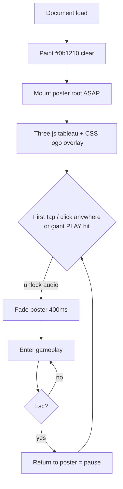

#### Layout (thumbnail-safe)

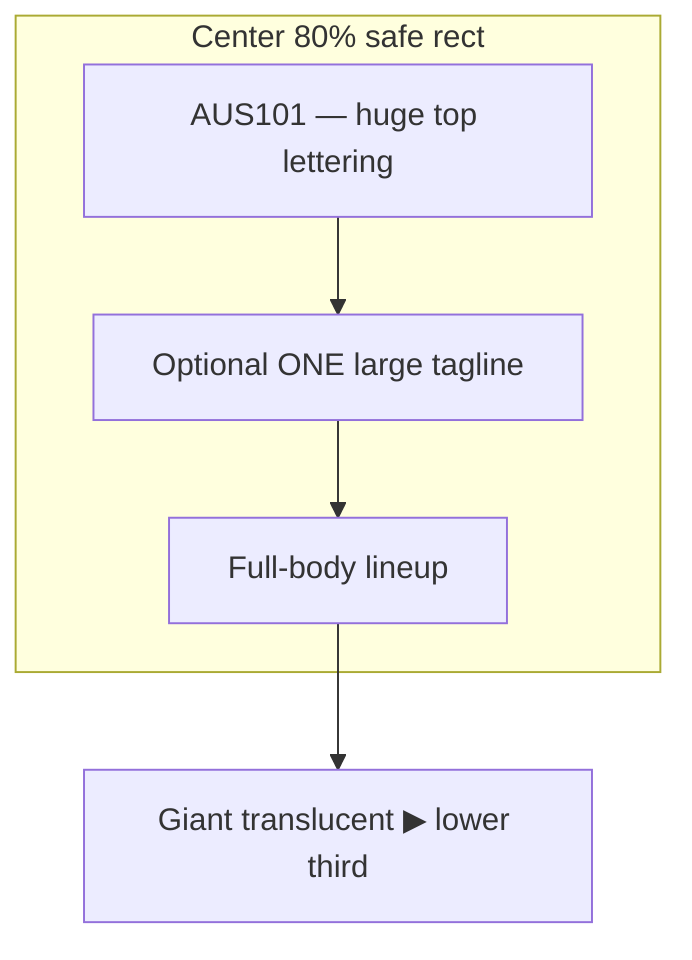

ASCII (~200–400px mental model):

```
┌────────────────────────────────────────┐
│              #0b1210 bleed              │
│   ┌────────── 80% SAFE ──────────┐     │
│   │         A U S 1 0 1          │     │
│   │    (huge; far-readable)      │     │
│   │   "TERMINATE UV" (optional)  │     │
│   │                              │     │
│   │   [goth?]  Ken  AUS101  Babe │     │
│   │            ♂     T-101   ♀   │     │
│   │              SIGMA_07        │     │
│   │         (long sleeves ON)    │     │
│   │         seagull / air        │     │
│   │                              │     │
│   │            ◁ ▶ ▷             │     │
│   │     (giant translucent PLAY) │     │
│   └──────────────────────────────┘     │
│   Gold Coast + boardwalk / teal-orange │
└────────────────────────────────────────┘
```

#### Visual brief

**Background.** Gold Coast beach + boardwalk under harsh noon. Color grade: Carpenter synth — deep teal shadows, hot orange speculars, chrome catching both. Horizon low enough that full-body cast clears the logo band. `html` / `body` / clear color `#0b1210` immediately — never a black void while assets load.

**Cast lineup (center-out, full-body).**

| Slot | Archetype | Silhouette must-read | Notes |
|------|-----------|----------------------|-------|
| Center | AUS101 | Chrome T-101, red eyes, rigid robot mass | Dead-center; eye pulse ~0.8–1.2s |
| Left flank | Ken-jock | Shirtless orange/tan, shark tooth, dyed hair | Broader shoulders than SIGMA |
| Right flank | Beach babe | Bikini / beach cut, open stance | Contrasts Ken mass |
| Near-center flank | SIGMA_07 incel | Long sleeves ON, narrower vertical | Never bare-arm; distinct from Ken |
| Optional | Goth + seagull | Secondary; shoulder or air | Must not merge with AUS101 chrome at 160px |

**Logo.** Top of safe rect: **AUS101** — one wordmark, maximum scale that still fits the center **80%** width with margin (Dynamic Island / letterboxing cannot crop the word). CSS/canvas overlay, not 3D text. No small text. No subtitle stack. No HUD. No controls legend.

**Tagline (optional, max one).** If present, one short LARGE line only — e.g. `I'LL BE BACK WITH SPF 50+` or `TERMINATE UV`. If it competes with the wordmark at thumbnail size, drop it.

**PLAY affordance.** Either (1) entire poster is the hit target, or (2) one giant translucent triangle in the lower third, opacity ~0.35–0.55, large enough that at 200px wide it still reads as play. Do not label it “Start.”

#### Implementation

1. Set clear / CSS background `#0b1210`.
2. **First paint:** CSS/canvas logo + committed Option B WebP (or solid beach gradient until WebP decodes). Never black void. Never instruction menu.
3. After CHAR0: stream meshes into `PosterScene` on the **same** `WebGLRenderer` / scene graph (swap cameras; do not recreate GL; do not double-resident twelve gameplay bodies — poster uses the four cast instances, gameplay subjects stay inactive or culled while poster is up). Fixed poses + idle wind / eye pulse / ~2–4% camera dolly over 8–12s.
4. On first pointerdown: `AudioContext` resume, 400ms opacity fade of poster root, handoff to gameplay.
5. Generate/update `og.webp` offline or in CI from an approved live still; laserbarf continues to screenshot the served URL, but the page’s LCP/`og:image` (and in-page first paint) prefer the static file so captures without WebGL wait still show cast+title.

#### Esc / pause table

When Esc returns to poster (or veil), apply this freeze (mirror Coconuts veil intent: tick/gain/lock stop):

| System | On pause (poster up) | On resume (tap/PLAY) |
|---|---|---|
| Sim clock / UV dose / lotion FSM | **Frozen** (`dt = 0`) | Continue |
| Chase agents / wanted & swarm timers | **Frozen** | Continue from remaining lock time |
| Carpenter / radio / ocean buses | **Paused** (suspend clock; do not tear down) | Resume |
| ApplyMode | **Force-exit**; release apply leash | Re-enter only on new squeeze/rub |
| Pointer lock | **Released** | Re-acquire on next gameplay gesture |
| Input (punch/laser/move) | **Ignored** except tap/PLAY and Key M | Restored |
| DOM | Poster overlay above HUD; HUD hidden | Poster faded; HUD shown |
| WebGL | Same renderer; poster camera active | Gameplay camera active |

#### Silhouette checks

- **laserbarf normative crop: 400×400** (`SCREENSHOT_WIDTH`/`HEIGHT` = 400 in laserbarf `includes/config.php`). Compose `og.webp` and the primary fixture so title + four silhouettes sit inside the **square center crop** — do not rely on landscape-only safe margins that square capture will clip.
- Also commit human-QA width strips at **160 / 240 / 400px** under `docs/fixtures/poster/` (plus `og-400x400.webp` matching ship). Pass only if `AUS101` letters are legible and four primary archetypes remain distinct without color reliance.
- Logo bounding box ⊆ center 80% of the **400×400** frame. No FPS, mute icon, hamburger, or “tap to start” paragraph in the capture.
- POSTER0 acceptance includes Option B **400×400** fixtures; POSTER1 acceptance requires CHAR0 meshes.

---

### 5.1 Systems — humor as state machine

Comedy is the state machine, not overlay copy.

- **Mission.** Cover twelve UV-tracked subjects. Win: mean coverage ≥ 0.92, no patch < 0.40. Score = `1000 * meanCoverage * (1 - 0.5 * overpaintPenalty)`.
- **T-101.** Chrome-and-flesh applicator. Does not tan or burn. It paints. 14 voice one-shots, event-triggered (`bottleEmpty`, `subjectComplete`, `overpaintChase`, `laserLock`). No joke timer.
- **Twelve subjects.** Each slot = mesh + `CoverageMap` + `ClothMask` + mood FSM (`idle → wary → chase | complete`). They sunbake until covered, then leave the bay.
- **Overpaint swimwear.** `ClothMask == 1` increments `overpaintMl`. 8 ml: he notices. 12 ml: `chase`. He path-follows T-101; camera stays in apply-mode until finish or grab.
- **Punch / laser.** Always legal, always fatal — *when they connect*. The input starts a swing or a ray; the hit test resolves mid-animation against adults only. A whiff harms nobody and summons nothing. A genuine hit reports `onHarm({ kind, victim, lethal, point })`, which is the only path to consequence: any hit raises **ALERT** (one spotter ship on station), and a lethal hit or 3 accumulated heat raises **RECALL** — the flight comes in from off-map, holds over a drop ring, and fast-ropes units that then run you down. **Cap:** 6–8 hulls. Game over on capture (a unit within 1.45 m held for 0.75 s), with a 30 s outer backstop so the sequence always resolves.

Constants in `src/sim/rules.js`:

```js
export const RULES = Object.freeze({
  winMeanCoverage: 0.92,
  winMinPatch: 0.40,
  overpaintNoticeMl: 8,
  overpaintChaseMl: 12,
  harmAlertHeat: 1,
  harmRecallHeat: 3,
  harmLethalHeat: 3,
  swarmCaptureR: 1.45,
  swarmFailS: 30,
  swarmHullCap: 8,
  bottleMl: 200,
  handMinMl: 4,
  handMaxMl: 6,
  subjects: 12,
});
```

#### Viewport / iPhone Safari shell

Target: iPhone Safari, landscape-primary, notch and home indicator live. Desktop is the same CSS.

**HTML head (committed playable):**

```html
<meta name="viewport" content="width=device-width, initial-scale=1, maximum-scale=1, user-scalable=no, viewport-fit=cover">
<meta name="apple-mobile-web-app-capable" content="yes">
<meta name="mobile-web-app-capable" content="yes">
<meta name="apple-mobile-web-app-status-bar-style" content="black-translucent">
<meta name="theme-color" content="#0b1210">
```

**CSS contract:**

| Token | Value | Why |
|---|---|---|
| canvas size | `100vh` × `100vw`, **not** `100dvh` | iOS `dvh` jumps on URL-bar show/hide and resizes the GL canvas |
| actual pixels | `window.innerWidth` × `window.innerHeight` | Safari lies about CSS px under notch; `innerHeight` matches the compositor |
| background | `#0b1210` | matches clear color; no white flash on overscroll |
| `user-select` | `none` on `html, body, canvas` | long-press must not select |
| `touch-action` | `none` on canvas | no pan/zoom steal |
| `-webkit-touch-callout` | `none` | no save-image sheet |
| safe-area probes | 4× 1 px `position:fixed` divs at `env(safe-area-inset-*)` | read `getBoundingClientRect` once per resize; HUD insets from those numbers |
| DPR | `Math.min(devicePixelRatio, 2)` | cap 2; never 3 on Pro Max |
| WebGL canvas | one element, one `WebGLRenderer`, lifetime = page | **never** recreate the context on rotate / URL-bar / tab-back |
| orientation | `screen.orientation.lock('landscape-primary')` when allowed; else CSS rotate prompt overlay |

Resize path (`src/shell/viewport.js`):

```
onResize():
  w = innerWidth; h = innerHeight
  dpr = min(devicePixelRatio, 2)
  renderer.setPixelRatio(dpr)
  renderer.setSize(w, h, false)   // do not touch canvas.style
  camera.aspect = w / h
  camera.updateProjectionMatrix()
  hud.applySafeArea(probeRects())
```

Input chrome: left virtual joystick (deadzone 0.18, radius 56 CSS px, above home-indicator inset + 12 px). Right hold zone = Apply. WASD/arrows move, Space = squeeze, Shift = rub on desktop. Punch = two-finger or `F`. Laser = three-finger or `G`.

#### Input + Apply Mode camera

Two cameras, one renderer. `PlayCamera`: third-person follow, offset `(0, 1.6, 3.2)`, lerp 8 Hz. `ApplyCamera`: surface-locked orbit while the trigger is down.

```js
/** @typedef {{ x:number, y:number, squeeze:boolean, rub:boolean, punch:boolean, laser:boolean, lookDx:number, lookDy:number }} FrameInput */

export function sampleInput(prev, pointers, keys) { /* ... */ }

export const ApplyRig = {
  yaw: 0, pitch: 0.35, radius: 1.15,
  pitchMin: 0.08, pitchMax: 1.15,
  radiusMin: 0.55, radiusMax: 2.40,
  enterLerpS: 0.22, exitLerpS: 0.18,
};
```

Enter Apply when `squeeze || rub` and a center ray hits a subject within 1.8 m. Exit when both triggers release 180 ms **or** the subject leaves the 2.4 m leash.

- Stick / WASD orbit (`lookDx`, `lookDy` → yaw/pitch). Deadzone 0.18.
- Space holds squeeze. Release with lotion on the hand starts rub if the pointer is on skin.
- HUD reticule locks to that bay slot. Radius = `max(radiusMin, hit.distance * 0.62)`.
- Raycast layer `ApplyPickLayer` (bit 2) includes cloth/hair/props so overpaint is pickable. Sand and sky are not.

#### 3D surface mapping (UV paint)

Coverage is a UV-space mesh paint pass, not a screen decal. Turning the body must not smear lotion into the sand.

**Normative target API:** persistent `THREE.WebGLRenderTarget` with `UnsignedByteType` + `RedFormat` (`gl.R8`). If `RedFormat` is unavailable, fall back to `RGBAFormat` and write coverage in `.r` only (shader `#define` from a one-time capability probe). **`THREE.FramebufferTexture` is non-normative** — it is a snapshot helper, not the paint store.

**Maps per subject:**

| Map | Size | Format | Role |
|---|---|---|---|
| `CoverageMap` | 256×256 | R8 → RGBA fallback | 0–1 fraction of skin with film |
| `ThicknessMap` | 256×256 | R8 → RGBA fallback | film thickness, 0–1 ≡ 0–0.08 mm |
| `ClothMask` | 256×256 | R8 → RGBA fallback | 0 = skin, 1 = swimwear / hair / eyes |
| `UvDoseMap` | 256×256 | R8 → RGBA fallback | accumulated UV, feeds erythema |

**Resident GPU maps:** full 256 R8 (or RGBA) targets for the **`applying` subject only**. Other tracked subjects keep CPU-side 64×64 coverage/uvDose summaries (or 128 RTT if memory allows); promote to 256 on apply lock. Quality-drop may paint at 128.

Paint pass (`src/sim/paintPass.js`):

1. Bind UV-unwrap RTT: vertex shader outputs `vec4(uv * 2.0 - 1.0, 0, 1)`. Same index buffer as the body.
2. Fragment: if `ClothMask == 1`, write to an overpaint accumulator (CPU-read 8×8 downsample each 250 ms), do **not** raise `CoverageMap`.
3. Else: `coverage = max(coverage, step(0.02, thickness))`; `thickness = clamp(thickness + deposit, 0, 1)`.
4. Deposit is a 2D anisotropic kernel in UV, warped by `UvMetric`. Prefer 128×128 `RG16F` texel-area texture; **feature-detect** half-float RT. If unavailable, use a constant texel-area uniform (no RG16F) — ear/chest ml/m² will be approximate.

Brush stamp: 24 px radius at 256, falloff `pow(1 - r, 1.6)`. One stamp per 2.5 mm of surface travel (arc length from last hit, not UV distance).

Readback for score: once per 200 ms, `gl.readPixels` a 64×64 blit of `CoverageMap` for the applying subject only. Expect **0.4–2.0 ms** stall on iPhone — budget and PERF0 measure wall time; if >2 ms median, drop to 32×32 blit or 400 ms interval. Mean of skin texels (`ClothMask == 0`) is `subject.coverage`. Patch min is the 5th percentile of that blit.

#### Squeeze-then-rub finite lotion physics

Lotion is conserved. Bottle 200 ml. Hand 4–6 ml. No infinite spray.

```js
export const Lotion = {
  bottleMl: 200,
  handMl: 0,
  handCapMl: 6,
  squeezeRateMlS: 9.0,     // bottle → hand while Space held and nozzle open
  transferRateMlS: 3.2,    // hand → skin while rubbing contact
  dripRateMlS: 0.55,       // hand excess above 6 ml, or vertical film > 0.85
  smearAniso: 2.8,         // kernel aspect along motion tangent
  minTransferMl: 0.02,
};
```

States:

- **`dry`** — `handMl < 0.05`. Rub is a no-op. Squeeze opens the bottle.
- **`charging`** — Space + nozzle in frame, +9 ml/s, cap 6. Past 6 drips to sand (`-score` 2 pts/ml).
- **`loaded`** — `handMl ∈ [4, 6]`. Palm sheen. Ready to rub.
- **`smearing`** — contact + motion. 3.2 ml/s into `ThicknessMap`, aniso kernel along surface velocity. Speed < 0.08 m/s deposits a blob (streaks).
- **`empty-hand`** — `handMl == 0` mid-rub. Audio tick. Return to bottle.

Drip: thickness > 0.85 on tris with `normal · up < 0.25` lose 0.55 ml/s → 1 px sand decals. Waste, not new coverage.

Squeeze charges only if the ray hits the bottle **or** T-101 is in bottle-hold pose (left hand occupied). Blocks Space-mash.

#### Skin lighting

One `MeshPhysicalMaterial` subclass (`src/mat/skin.js`). Maps drive it. No second lighting model.

| Signal | Map | Shader use |
|---|---|---|
| dry skin | none | `roughness 0.72`, `clearcoat 0.0`, `sheen 0.15` (peach) |
| film present | `CoverageMap` | `clearcoat = 0.55 * coverage`, `roughness = mix(0.72, 0.28, coverage)` |
| thick film | `ThicknessMap` | `clearcoatRoughness = mix(0.35, 0.08, thickness)`; white-cast `+ vec3(0.10) * thickness` |
| UV dose | `UvDoseMap` | `UvDose += dt * sunIrradiance * (1 - 0.92 * coverage)` |
| erythema | derived | `albedo *= mix(1.0, vec3(1.0, 0.45, 0.42), smoothstep(0.55, 1.0, uvDose))` |

White-cast is the gag and the readout: painted chest = zinc stripe, not wet look. Unpainted skin goes red. Miss is a color, not a number.

**Lighting ownership:** single table in `src/world/lights.js` (World owns; Systems consumes). Normative noon defaults:

```js
export const LIGHTS = Object.freeze({
  sunColor: 0xfff1c2,
  sunIntensity: 1.85,          // not a second 2.4 path
  sunPosition: [18, 42, -8],
  hemiSky: 0x7ec8ff,
  hemiGround: 0xc4a574,
  hemiIntensity: 0.55,
  fog: { color: 0xc9dbe8, density: 0.012 },
  shadowMapSize: 1024,         // default; quality-drop → 512; never 2048 on iPhone
  shadowsOnPaintTargets: false,
  shadowCasters: ['player', 'swarm'],
});
```

Do not fork a second sun color/intensity in the skin section. Skin clearcoat reads under this light.

#### Twelve-slot reticule bay

HUD is a 12-cell bay along the safe-area top (left if `innerWidth < 700`). One cell per subject.

```js
/** @typedef {{
 *   id: 0|1|2|3|4|5|6|7|8|9|10|11,
 *   state: 'empty'|'tracked'|'applying'|'complete'|'chase'|'gone',
 *   coverage: number,
 *   overpaintMl: number,
 *   uvDose: number,
 *   mesh: THREE.Object3D,
 *   maps: { coverage, thickness, cloth, uvDose }
 * }} ReticuleSlot
 */
```

Lifecycle:

1. Boot: 12 subjects spawn in a 28 m beach strip. Each slot = `tracked`.
2. Apply-mode ray hit promotes that slot to `applying` (gold ring, 2 px).
3. `coverage ≥ 0.92` and `minPatch ≥ 0.40` and `overpaintMl < 8` → `complete`. Subject walks off. Slot stays as a green pip.
4. `overpaintMl ≥ 12` → `chase`. Slot goes red. Other slots keep ticking UV.
5. Grab or swarm → all slots `gone`.
6. All 12 `complete` → win.

Tapping a pip yaws the camera at that subject (0.3 s), no teleport. UV-track mark is a projected 18 px circle at the last paint hit.

#### Fail states

| Id | Trigger | Result | Recoverable |
|---|---|---|---|
| `sunburn` | any slot `uvDose ≥ 1` for 3 s | that subject leaves angry; slot `gone`; if 3 gone this way, lose | no |
| `overpaint-chase` | `overpaintMl ≥ 12` | guy chases; grab on contact (`dist < 0.55 m` for 0.4 s) | yes, if you finish other 11 and never get grabbed |
| `grabbed` | chase contact | game over, 1.2 s hold, then restart prompt | no |
| `punch` | `input.punch` | swing; hit test at mid-animation, adults only. Miss = nothing happens | — |
| `laser` | `input.laser` | ray from the eyes; beam draws and scorches on a miss, harms only what it hits | — |
| `harm` | punch or laser connects | `onHarm` → ALERT; lethal or 3 heat → RECALL | no |
| `swarm-lock` | a unit reaches you | capture hold 0.75 s, game over card | no |
| `bottle-dry` | `bottleMl == 0` and mean coverage < 0.92 | lose (text: “200 ml. That’s the joke.”) | no |
| `drown-drip` | 40 ml dripped to sand | warning only; not a lose | — |

**Wanted → swarm sequence (2.4 s):**

1. On punch/laser: force-exit ApplyMode; lock move/punch/laser input; keep look.
2. Fire `PANIC` VO immediately; if anyone is hurt / laser hit registered, **FACTORY_RECALL** preempts per director priority (cuts DJ/NPC).
3. Duck radio −6 dB (same as apply duck); play `world.heli` on sfx bus (spatial pan L→R); optional red “WANTED” HUD pip — not the poster.
4. At 2.4 s: spawn ≤`swarmHullCap` instanced hulls; game-over card (separate from poster; restart CTA). Restart = sim reset + optional return to poster brand frame; **not** a WebGL recreate. `glClear` the maps. Same canvas.

#### Performance budget

iPhone 13-class, 60 Hz when the URL bar is hidden, 30 Hz floor. **PERF0** lands after P3 (readback + one physical skin) — do not wait for end-of-plan PERF.

| Resource | Budget | Note |
|---|---|---|
| triangles, world | 90 k | beach 20 k, T-101 18 k, 12 bodies × 4 k, FX 4 k |
| triangles, apply-mode | +0 | same meshes; paint is UV pass |
| GPU paint RTTs | 1 subject × 4 × 256 | others CPU/64 summaries; see UV section |
| textures | ≤ 48 MB | maps + sand + sky + skin atlases |
| shadow map | 1024 default / 512 drop | not 2048 on mobile |
| draw calls | 45 | bodies instanced in idle, unique when `applying` or `chase` |
| paint pass | 1.2 ms | one subject / frame, the `applying` one |
| readback | **measure**; target <2 ms / 200 ms | 64×64; sync cost is real on iOS |
| JS sim | 2.0 ms | lotion + FSM + chase |
| DPR | ≤ 2 | see viewport |
| audio voices | 8 | one-shots |
| decoded AudioBuffer LRU | 16 buffers; ≤ ~8 MB decoded | voiceCache eviction |
| swarm hulls | ≤ 8 | instanced; quality-drop → 4 |
| poster vs gameplay | one renderer; poster cast ≠ 12 live subjects | Esc must not double-resident |

If `dt > 28 ms` for 20 frames: drop sand shadows (or 512→off), paint at 128, freeze idle bodies beyond 12 m, swarm 4, skip tracker. Prefer `MeshStandardMaterial` world props; reserve `MeshPhysicalMaterial` (clearcoat) for paintable skin only — if PERF0 shows clearcoat too hot, fall back to Standard + white-cast albedo hack. Never drop the canvas.

#### Systems Mermaid

##### Apply-mode sequence

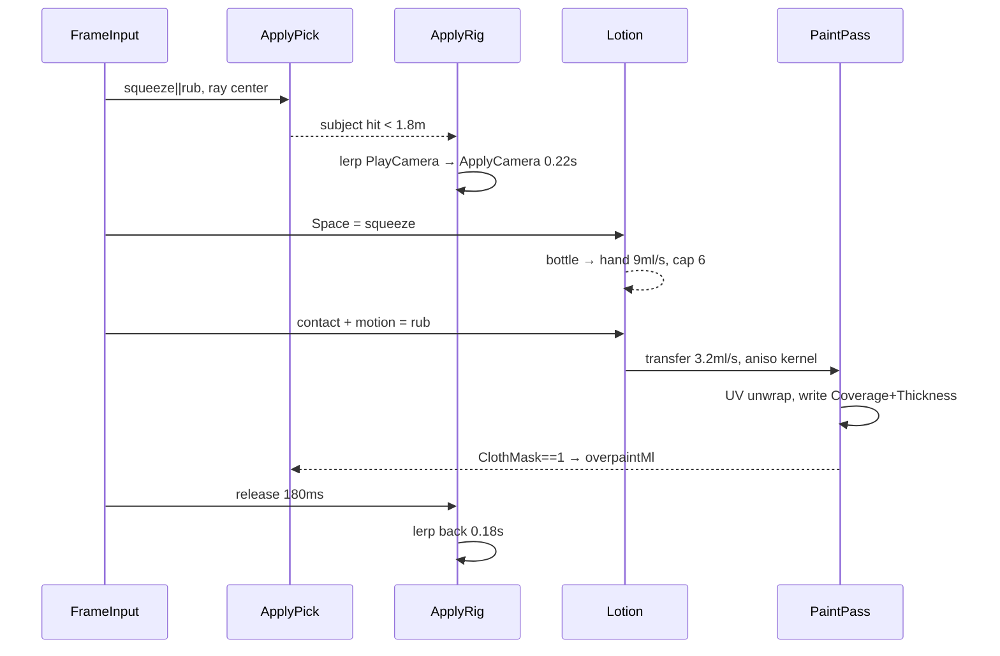

##### Lotion state machine

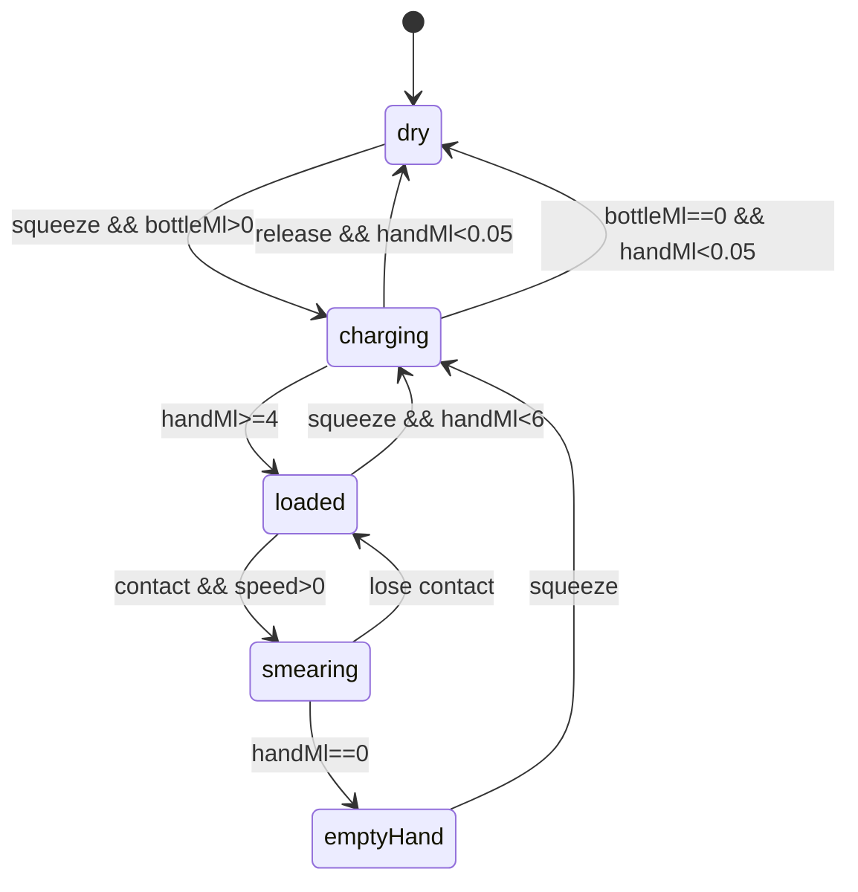

##### Coverage → lighting

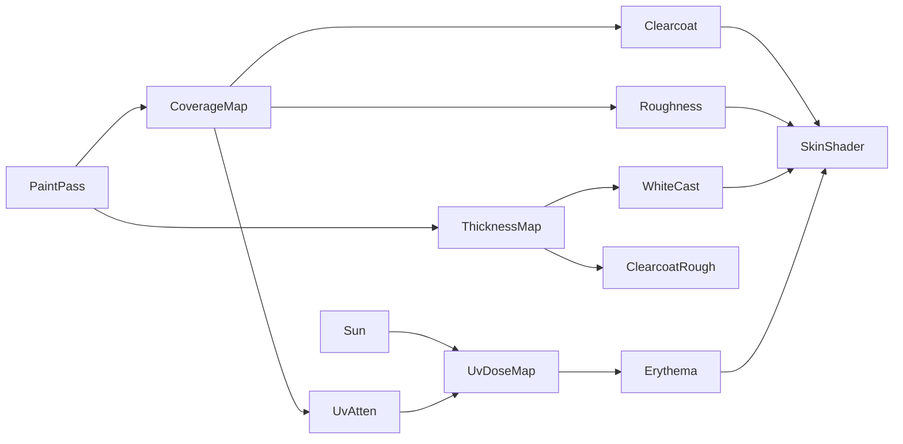

##### Reticule lifecycle

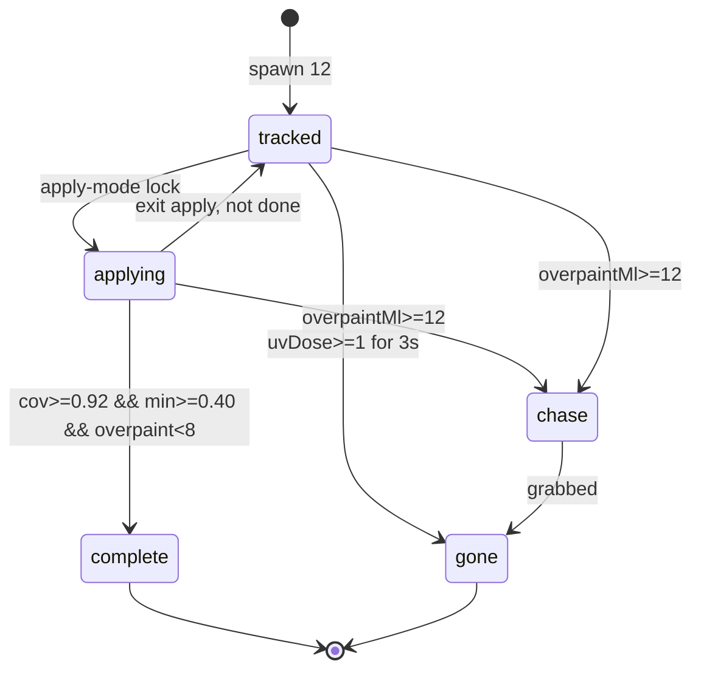

---

### 5.2 World — Gold Coast port from Coconuts patterns

AUS101 is a greenfield walkaround. Ship artefact: `npm run build` → committed `dist/` on a static host (see §5.6 Build).

Coconuts ([a-better-internet/coconuts](https://github.com/a-better-internet/coconuts) by **Steve**) is a single ~160 KB **IIFE** (`index.html`, Three **r128 CDN**). There are **no** clean exportable `umbrella` / `gull` / `palm` modules — builders are inline (`chairStack`, seagull block, etc.). **Port patterns; rewrite into ES modules.** Do not claim “extract functions.” Hotel, castle, bar interior, Maryland flags, drinks, intoxication, foam gun, and the r128 CDN stay behind. Port: mover / `COL[]` / `addCollider`, procedural ocean+crowd unlock, `vmScene` overlay, foam-settle (`settled` / foam surf math → lotion drips), Shift 3.4→6.4, `KeyM` mute, canvas-texture helpers. Credit Steve in README and CREDITS.md.

The new majority is an ~80 × 50 m Gold Coast beach, a 12 m timber boardwalk, a nearer shore-break whose foam dies on wet sand, an SPF kiosk, a lifeguard tower, and film-culture set dressing. Those props do not fire, cut, or apply to other players.

#### Coordinate frame

Origin: dry sand at the boardwalk face, mid-strand.

| Axis | Direction | Span |
| --- | --- | --- |
| +X | north along the strand | −40 … +40 m |
| +Z | seaward | 0 boardwalk face; +38 mean water; +50 wade clip |
| +Y | up | 0 dry sand; boardwalk +1.1; tower deck +4.8 |

Total rectangle 80 × 50 m. Sand is 80 × 38 m to mean water, then 12 m of shallows. Inland, an 80 × 12 m deck on piles (Z = −12 … 0). `COL[]` AABBs close four edges: invisible 2.2 m walls on three sides; a soft waist-high plane at Z ≈ 46.

Three bands, no heightmap:

1. Boardwalk — flat `Y = 1.1`, 80 × 12, plank canvas.
2. Dry / damp sand — `Y = 0` for Z = 0 … 28, then a 6 m ramp down 0.25 m.
3. Wet sand + shallows — `Y = −0.25` for Z = 34 … 38; water surface `Y = 0.15`; wade floor to `Y = −0.9` at Z = 50.

No dunes, rocks, or hotels. Sky is a hard dome plus a distant island billboard (Stradbroke-ish, not OC skyline).

**Noon default.** Boot and stay at harsh AU noon via `src/world/lights.js` (`LIGHTS` table above). Optional leftover: port Coconuts’ **continuous** `dayTime` cycle with **`KeyT` fast-forward** (there is no KeyN toggle upstream). Night may reuse moon + lamp/torch if the cycle is enabled; noon remains the product default. Shadow map size = `LIGHTS.shadowMapSize` (1024 / 512 drop), PCFSoft, sun only.

#### Port from Coconuts (patterns → ES modules)

Vendor an unmodified snapshot at `vendor/coconuts/` (+ NOTICE). **Rewrite** into `src/`; W0 acceptance lists symbols **copied as reference** vs **rewritten**.

| Area | Coconuts reality | AUS101 module |
|---|---|---|
| Mover / look / `COL[]` / bob / veil | Real in IIFE | `src/player.js` — WASD/arrows; Shift 3.4→6.4; pointer-lock; spawn `(0, 1.7, 4)` +Z |
| Audio unlock / ocean / crowd / `KeyM` | Real | `src/audio.js` + later `src/audio/*` — retune dump Z≈36; no ice-machine/clink/foam-gun hiss |
| `vmScene` | Real | `src/vm.js` — SPF bottle + palm; `vm.drip()` |
| Foam settle | `settled` + foam surf | `src/drips.js` — lotion settle discs only |
| Prop builders | Inline, not modules | `src/props/core.js` + `beach.js` — rewrite `canvasTex`/`mat`/`box`/`addCollider` and beach props; Gold Coast recolour |
| Day / night | Continuous `dayTime`; **`KeyT` fast-forward** (not KeyN) | Optional: port continuous cycle + `KeyT`; **boot noon and stay noon by default**. No KeyN. |

**Do not reuse as setting:** hotel / castle / bar; Maryland flags; drinks / intox; foam-gun mesh; Three r128 from CDN. **Three r160** vendored/bundled (see §5.6).

#### New terrain

**Sand / water.** Dry: `PlaneGeometry(80, 38)`, quartz canvas `0xe6c98a`. Wet: `80 × 8` at `Y = −0.25`, `0xc4a06a`. Water: `80 × 16` at `Y = 0.15`, teal, two-sine vertex displace (4.2 s / 7.0 s).

**Shore-break.** Dump line Z ≈ 36. Three ribbons 70 × 0.8 × 0.6 m, 11 s cycle, −Z at ~2.4 m/s. At Z = 36: scale Y to 0.08 in 400 ms, spawn settle discs. Disc on wet sand fades in 300 ms; disc in water lingers 1.2 s. No foam on dry sand. Collapse ducks the ocean high-shelf +200 Hz for 0.5 s.

**Boardwalk.** 80 × 12 at `Y = 1.1`. Ironbark plank canvas `0x6b4a2b`. Piles every 4 m. Stairs: two 3 m flights at X = ±24. One deck AABB snaps the mover to `Y = 1.1`.

**SPF kiosk** at (−14, −6) on the deck, 4.2 × 3.0 × 3.2 m. Awning canvas “SPF / ZINC / 50+” — no real brand. Bar-builder pattern (`box` + `canvasTex` + `addCollider`).

**Lifeguard tower** at (18, 6) on dry sand. Deck `Y = 4.8`, roof `Y = 6.4`. Climbable loft pattern. Yellow-red SLSA-ish panels, no official mark.

#### Film-culture props (scenery, not weapons)

New factories in `src/props/film.js`. Under 40 tris except the tent. Not inventory.

| Prop | Factory | Place | Behaviour |
| --- | --- | --- | --- |
| Vape | `vape({led})` | 6 on rails / kiosk | LED 1.6 s; puff every 4–7 s |
| Cigarette | `cig()` | 8 in trays / dummy lips | Ember 0.15; thin smoke |
| Novelty lighter | `lighter({skin})` | 3 on counter / lounger | Banana / skull / thong canvas. No jet |
| Portable radio | `radio()` | 2 sand, 2 deck | Spatial 3-tone bed; `KeyM` mutes |
| Camcorder tourist | `touristCam()` | 3 on sand, face sea | Box cam + red REC. No pathing |
| Blow-up palm | `inflatablePalm()` | (−32, 10) | Gloss, sine sway; 0.4 m trunk collider |
| Spray-tan tent | `tanTent()` | (28, −7) on deck, 2.4³ | Orange nylon, solid AABB |

Keep the centre (X ∈ [−8, 8], Z ∈ [8, 22]) open so the first ten seconds of walk-to-sea read as a beach.

#### World layout Mermaid

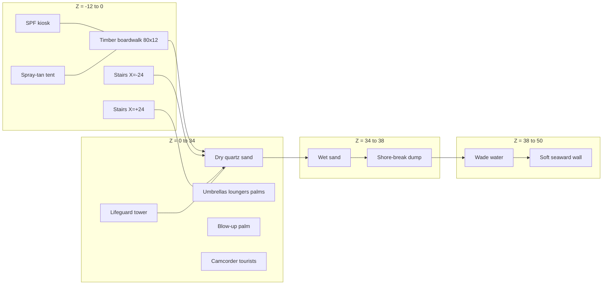

#### Port vs new Mermaid

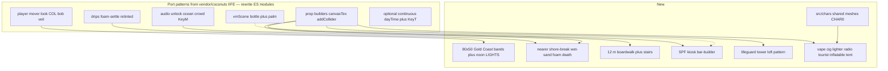

#### Repo / dist shape

```
sunscreen/
  vendor/coconuts/     # unmodified snapshot + NOTICE (Steve)
  vendor/three/        # r160 three.module.js — bundled into dist/game.js
  src/
    main.js            # esbuild entry
    chars/             # CHAR0 shared body primitives
    player.js
    vm.js
    drips.js
    world.js
    world/lights.js    # LIGHTS single source
    props/core.js
    props/beach.js
    props/film.js
    shell/viewport.js
    shell/poster.js
    sim/rules.js
    sim/paintPass.js
    mat/skin.js
    audio/context.js
    audio/carpenter.js
    audio/chorus.js
    audio/voiceCache.js
    audio/radio.js
    audio/mix.js
    audio/director.js
  tools/voice/bake.mjs
  tools/voice/lines.json   # SOURCE OF TRUTH for all barks + DJ
  assets/voice/*.mp3
  assets/voice/manifest.json  # build-emitted id→path from lines.json
  assets/poster/og.webp       # Option B required for laserbarf v1
  assets/synth/*.wav
  assets/sfx/
  assets/mods/         # optional
  docs/parts/grok-design-part-sfx-3641153d.md  # authoritative SFX shopping list
  docs/fixtures/poster/
  dist/index.html
  dist/game.js         # esbuild bundle — no tools/voice in graph
  package.json         # "build": "node scripts/build.mjs"
  CREDITS.md           # Steve + SFX + synth
  README.md
```

---

### 5.3 Audio — Reticule FM, Carpenter, Juno

Self-contained client. All sound is files on disk plus Web Audio. Nothing phones home at play time.

#### Policy: TikTok TTS is a build tool

Voice lines come from [oscie57/tiktok-voice](https://github.com/oscie57/tiktok-voice). **Build machine only.** The shipped game never imports that client, never holds a sessionid, never hits `tiktokv.com`.

**Source of truth:** `tools/voice/lines.json` only. Build emits `assets/voice/manifest.json` (id → relative path, ageBand, tags). Runtime loads the manifest + MP3s — **do not** keep a second divergent `src/audio/lines.json`. Schema validation and CI missing-MP3 checks read the tools sheet / manifest.

Pipeline:

1. Author `tools/voice/lines.json` — id, text, voice, category, priority, ageBand, tags.
2. `node tools/voice/bake.mjs` reads the sheet, POSTs TikTok (build machine; `sessionid` from env / secret store — **never commit**), writes `assets/voice/<id>.mp3`.
3. Commit the MP3s + regenerated manifest. CI fails if a line id is referenced and the file is missing.
4. Runtime (on **static same-origin host**): `fetch` relative `assets/voice/<id>.mp3` + `decodeAudioData`. Not supported under `file://`.

Allowed bake voices (exact TikTok keys): `en_au_001`, `en_au_002` (Gold Coast / DJ); `en_us_*` tourists; `en_uk_*` Poms; `c3po`, `stormtrooper`, `rocket`, `stitch` spice; `en_male_funny`; `en_female_emotional`; `en_male_narration` alt DJ.

DJ voice: `en_au_002` first. Fallback bake: `en_male_narration` then one-pole AM chain at bake time. Do not run that EQ live.

**TikTok ToS / redistribution risk:** unofficial session API. Treat bake as best-effort; document secret handling; confirm committed MP3s may ship under the game license (Open Question / Risk). Fallback: alternate offline TTS or re-record if TikTok bake breaks — runtime never calls TikTok.

Budget: ~200 NPC lines + **53 DJ files** (`dj_open_01` + `dj_quip_01`…`49` + `dj_song_01`…`03`). Encode **32 kbps mono MP3**. Target folder ≤ 4 MB. Runtime LRU cache of **16** decoded `AudioBuffer`s (≤ ~8 MB decoded). 3D: `PannerNode` HRTF, `refDistance` 4 m, `rolloffFactor` 1.2, max 28 m. DJ and music are 2D.

Priority: `panic > protest > rub > walkby > DJ > gull`. Gulls never steal.

#### Station: Reticule FM 101.7

Brand: **Reticule FM 101.7**. Subline: “Gold Coast / after dark.”

| Action | Desktop | Mobile |
|---|---|---|
| Prev | `[` | tiny safe-area button, left of Pause |
| Pause / play | `P` | centre button |
| Next | `]` | right button |
| Volume | mouse on HUD slider; keys `-` / `=` optional | vertical drag on the three-button cluster |

Cold open after first unmute: *“it’s a beautiful day on the Gold Coast.”* (`dj_open_01`). Announce every song change. Between tracks, pull from the 50-line catalog. No repeat until the bag is empty.

#### Catalog — DJ lines (53 committed MP3s)

Bake voice `en_au_002`. Prefix `dj_`. Copy is locked. **Count:** 1 open + 49 quips (`dj_quip_01`…`49`) + 3 baked song announces (`dj_song_01`…`03`) = **53 files**. Prose “50 DJ quips” means the quip bag + open; A5 done-when uses the 53-id set. Template `dj_song_fmt` is bake-time only (not a runtime file).

1. `dj_open_01` — it’s a beautiful day on the Gold Coast
2. `dj_quip_01` — Reticule FM 101.7, still on the air, still pretending the sun is your friend
3. `dj_quip_02` — if your skin is already pink, that is not a tan, that is a warning
4. `dj_quip_03` — coming up: more songs, more glare, fewer good decisions
5. `dj_quip_04` — this next one is for anyone hiding under a towel like it is architecture
6. `dj_quip_05` — remember, zinc is a lifestyle, not a suggestion
7. `dj_quip_06` — traffic on the highway is fine; traffic on the sand is you
8. `dj_quip_07` — we play the hits so you do not have to think about the UV index
9. `dj_quip_08` — shout-out to the bloke who brought a whole esky and no hat
10. `dj_quip_09` — 101.7, where the chorus hits harder than the two o’clock sun
11. `dj_quip_10` — if you can hear the gulls over me, turn me up, not them
12. `dj_quip_11` — Gold Coast weather: bright, brutal, and not taking questions
13. `dj_quip_12` — this is your captain speaking; the captain is a radio and he is not sorry
14. `dj_quip_13` — apply, reapply, then apply again like you mean it
15. `dj_quip_14` — we do not do request hours; the ocean already requested your hat
16. `dj_quip_15` — next track is colder than the change rooms and twice as honest
17. `dj_quip_16` — Reticule FM, broadcasting from somewhere you should not nap
18. `dj_quip_17` — if your shoulders are glowing, that is not aura, that is physics
19. `dj_quip_18` — hold your kids, hold your keys, hold your SPF
20. `dj_quip_19` — this one goes out to the last bottle of 50-plus on the whole strip
21. `dj_quip_20` — you can mute me; you cannot mute the sun
22. `dj_quip_21` — 101 point 7, slightly out of tune on purpose, like a holiday
23. `dj_quip_22` — the forecast is: more forecast
24. `dj_quip_23` — I have seen that rash shirt before; it did not win last time either
25. `dj_quip_24` — stay with us through the heat shimmer; we are not going anywhere
26. `dj_quip_25` — if you came for talkback, wrong decade, wrong station, right beach
27. `dj_quip_26` — spinning another one before the tide takes the speaker
28. `dj_quip_27` — sunscreen first, opinions later
29. `dj_quip_28` — this is the part of the afternoon where everyone becomes a lizard
30. `dj_quip_29` — Reticule FM: less chat, more shade
31. `dj_quip_30` — I will be here when the umbrellas fail
32. `dj_quip_31` — next up, something with a pulse and no UV
33. `dj_quip_32` — do not look directly at the water; it is showing off
34. `dj_quip_33` — 101.7, for people who packed snacks and forgot water
35. `dj_quip_34` — the boardwalk is a runway and nobody rehearsed
36. `dj_quip_35` — keep your radio close; the gulls are unionising
37. `dj_quip_36` — we interrupt this sunshine for more sunshine
38. `dj_quip_37` — if you are listening in a car park, stay in the car park
39. `dj_quip_38` — that smell is coconut, panic, and chips
40. `dj_quip_39` — Gold Coast after lunch: the real boss fight
41. `dj_quip_40` — I am not your dad; I am louder than your dad
42. `dj_quip_41` — Reticule FM 101.7, still legal, still sticky
43. `dj_quip_42` — one more song, then you reapply, then one more song
44. `dj_quip_43` — the tide chart lies; the burn does not
45. `dj_quip_44` — this next cut is for the towel that will never be the same
46. `dj_quip_45` — we fade, we do not ghost
47. `dj_quip_46` — if the sky looks empty, that is the point
48. `dj_quip_47` — stay hydrated or stay home; I cannot do both for you
49. `dj_quip_48` — 101.7, coming at you from the wrong side of the umbrella
50. `dj_quip_49` — beautiful day, terrible idea, perfect radio
51. `dj_song_fmt` — that was {title}; this is {title}; do not take that as medical advice

Line 51 is a template. Bake three concrete fills (`dj_song_01`…`03`). Runtime concatenates only baked files — no live TTS.

#### John Carpenter 80s bed (must-ship)

File: **`src/audio/carpenter.js`**. Ships in the first playable build. Must start on a cold iPhone. No Carpenter scores. No YouTube rips. Original sequence only.

- Key **D minor**. Tempo **108–118 BPM** (default 112).
- Pulse bass: eighths on D1/D2, ghost on the off-beat, octave jump every 8 bars.
- Rim on 2 and 4. Occasional tom fill bar 15.
- **Slasher-close apply stem**: high D / A cluster when apply starts. 900 ms swell, hard cut on release.

Juno-106 character (mandatory):

- DCO: saw or square, slight analog drift ±4 cents, optional PWM on pads.
- Filter envelope **swells**, not plucks. Attack 180–400 ms on pads, 8–20 ms on bass.
- **Stereo BBD chorus is mandatory** on pads: two delay lines, LFO **~0.6 Hz**, delay **8–12 ms**, opposite phase, mix 35–45%. Two `DelayNode`s + two LFO `OscillatorNode`s. No “chorus = slight detune.”

Commit **~400–800 KB** 16-bit WAV under `assets/synth/` (`juno_saw_c2/c3/c4.wav`, `juno_square_c3.wav`, `juno_pwm_pad.wav`, `pink.wav`, `rim.wav`, `tom.wav`). Licence: **CC0 or CC-BY only**. If a sample cannot be licensed, fall back to `OscillatorNode` + same chorus graph. Never ship silence.

Optional tracker pack: 4–8 `.it` / `.xm` in `assets/mods/`. Feature-detect; iOS fail → `carpenter.js`.

#### Mix buses

| Bus | Default | Rule |
|---|---|---|
| `ocean` | −16 dB | always under |
| `crowd` | −18 dB | always under |
| `radio` | −8 dB | DJ + beds + tracker |
| `voice3d` | 0 dB | NPC panners |
| `apply` | 0 dB | slasher stem |
| `sfx` | −2 dB | Foley / combat; duck −6 dB under VO |
| `gull` | −20 dB | lowest priority |
| `master` | 0 dB | KeyM target |

- Ocean and crowd sit **under** the radio. Never sidechain them to the DJ.
- **Apply ducks radio −6 dB** for the duration of the rub plus 200 ms release.
- **Key `M` mutes all** — persist `localStorage` key `aus101.mute`. iOS silent switch still wins.
- First user gesture calls `audioCtx.resume()`.

#### Audio graph Mermaid

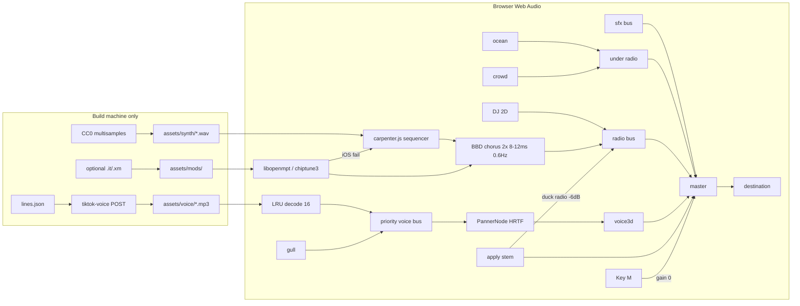

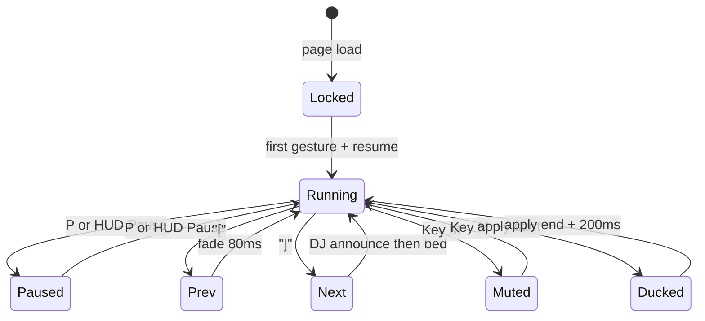

---

### 5.4 NPCs, dialog, age bands

Schema, age-band lock, archetypes, catalogs, two-channel director. INCEL is satire: SIGMA_07 / "Trevor from the forum". Never a real killer name. Never manifesto text. Kids ambient, not paint targets. Gulls are birds. Adult tropes stay on `ageBand: adult`.

#### Line schema

`tools/voice/lines.json` is the flat-array source of truth. Build emits `assets/voice/manifest.json` for runtime. No second hand-edited runtime catalog. No runtime string concat.

```json
{
  "id": "goldcoast.flume.01",
  "text": "hey chrome boy, you don't know where I can get some Flume tickets",
  "voice": "lad_goldcoast_01",
  "speaker": "HARDSTOMP_LAD",
  "ageBand": "adult",
  "tags": ["walkby", "gold_coast_lad", "music"],
  "cooldownMs": 18000,
  "gain": 0.85
}
```

| Field | Rule |
| --- | --- |
| `id` | `{catalog}.{slug}.{nn}`, stable |
| `text` | spoken + subtitle, no markup |
| `voice` | bank id → WAV/MP3 folder |
| `speaker` | archetype enum |
| `ageBand` | `adult` \| `child` \| `gull` \| `system` |
| `tags` | catalog + mood; tropes adult-only |
| `cooldownMs` | per-id floor |
| `gain` | 0.2–1.0 |

**CI test:** trope tags cannot attach to `child`. `rub_pleasure` / `walkby_flirt` / `incel` / adult sex-or-drink tropes require `ageBand: adult`. Paint resolver never returns a `KID` collider.

#### Hard rules

1. Adult 80s tropes and sexualized jokes only on `ageBand: adult`.
2. Children ambient, not paint targets. Sassy, kid-safe. No drink, sex, forums, violence.
3. Gulls are not children. `speaker: GULL`, `ageBand: gull`.
4. SIGMA_07 is satire. Shirt stays on. ClothMask almost all cloth. Walk-by heckle or paint-refuse. Not a violence fantasy. Factory Recall still fires if anyone is hurt.
5. One VO + one incidental. No double-book.
6. **Everyone is mocked.** Adult vanity / Ken humor is adult-only.

#### Archetypes

1. **Hardstomp lad — `HARDSTOMP_LAD`.** Die-dyed blonde, shark-tooth necklace, shirtless, boardies. Signature: *"hey chrome boy, you don't know where I can get some Flume tickets"*.
2. **80s goth — `GOTH`.** Black linen, cig, boots in sand.
3. **Walk-by babes / jocks — `WALKBY_BABE`, `WALKBY_JOCK`** (gossip speakers also `beach_babe`, `jock_ken`). Camp 80s adult tropes. Adult only.
4. **Overpaint + chase — `OVERPAINT`, `CHASE`.**
5. **Punch / laser panic — `PANIC`.**
6. **Seagulls — `GULL`.** Not children. *"ima bird kid, just flyin outta here"*.
7. **Kids — `KID`.** Ambient. Not paint targets.
8. **AUS101 HUD — `AUS101_HUD`.** Deadpan terminator public-health VO. `ageBand: system`.
9. **Factory T-101 recall — `FACTORY_RECALL`.** Interrupts everything but itself. Four director lines. Not comedy.
10. **INCEL — `SIGMA_07`.** Satire. "Trevor from the forum". Long-sleeve black graphic tee, cargos, socks-and-sandals. Shirt stays on. Incel tropes + `/iamverysmart`.

Bit-part adults (mocked): `lifeguard`, `ice_cream_vendor`, `camcorder_dad`, `spray_tan_tech`.

#### Starter catalogs (concrete text)

Default `cooldownMs`: walk-by 14000, rub 8000, heckle 16000, HUD 12000, gull 9000, child 20000, incel 22000, panic 6000. Gossip pools: 45000 + per-pair lockout.

##### rub_pleasure — 12 — `ageBand: adult`

1. mmm that feels so good
2. keep going chrome, right there
3. oh you are *fully* functional
4. don't you dare stop, clanker
5. that's the spot, that's the spot
6. who taught a T-unit to give a rubdown
7. harder, terminator, I paid for this tan
8. if this is a firmware test I pass
9. your hands are cold and I am not complaining
10. do the shoulders again, metal man
11. I am going to tell everyone on Cavill you do this
12. okay wow, okay, stay in that loop

##### walkby_flirt — 12 — `ageBand: adult`

1. nice abs, clanker
2. are you *fully* functional
3. hey chrome, you come here often or do you just wash up
4. those arms could bench the whole strip
5. leave some shine for the rest of us
6. if I said oil me would that be a warranty issue
7. you look like the sequel and I watched the first one twice
8. walk with me, I'll buy you a Solo
9. is that a plasma rifle or are you just happy to patrol
10. I'd let you protect me from the future
11. smile if your mouth even does that
12. save me from these mortals, chrome boy

##### walkby_heckle — 10 — `ageBand: adult`

1. nice paint job, toaster
2. go oil yourself, clanker
3. who let Skynet on the Esplanade
4. you here to take our jobs or just our sunscreen
5. beep beep, rust bucket
6. my fridge has more personality
7. chrome doesn't make you a local
8. put a shirt on — wait, you don't even have skin
9. terminator's lost, somebody point him at Brisbane
10. if you're the future I'm moving inland

##### gold_coast_lad — 12 — `ageBand: adult`

1. hey chrome boy, you don't know where I can get some Flume tickets
2. bro if Fisher drops at Hardstomp I'm sleeping on the sand
3. you been to Lost Paradise or are you just a Surfers tourist unit
4. Kylie's doing a secret set, I can feel it in me teeth
5. Sia would smash this beach, no face, all vibe
6. Tame Impala at the boat party and I'm not coming home
7. mate I drank the whole slab, the slab drank me back
8. chrome boy you want a midstrength or are you union
9. shark tooth's real, I pulled it off a vending machine in Broadbeach
10. don't paint me bro I just dyed this blonde for the weekend
11. Surfers boat party, no shirt, no plan, no liver
12. if you're not on the Hardstomp shuttle you're not on the guest list

##### goth — 10 — `ageBand: adult`

1. what does it all mean?
2. nothing matters anyway
3. hey don't you ever get bored of being people's slaves, here try my cigarette
4. the sun is a lie we all agreed to
5. I came to the beach to feel worse and it's working
6. your chrome is just another costume, same as this linen
7. smoke's the only honest weather
8. they will oil you and still call it love
9. I lit this for the void, you can have the next one
10. stop shining, some of us are trying to fade

##### child_sassy — 8 — `ageBand: child` — not a paint target

1. hey whatcha lookin at? never seen a kid before??
2. my mum said don't talk to chrome people but you started it
3. you walk funny, like a fridge on holiday
4. I had a robot at Christmas, he was shorter
5. stop staring, I can do that too, see
6. if you're lost the ice cream is that way
7. I'm not sharing my chips, get your own
8. are you even allowed on this beach without a grown-up

##### gull — 10 — `ageBand: gull`

1. ima bird kid, just flyin outta here
2. that's my chip, that's always been my chip
3. I pay no rent and I fear no ranger
4. squawk means mine, also mine, also that one
5. you can't ticket a seagull, I checked
6. I invented stealing, you're just the sequel
7. beach is a plate and I am the fork
8. if it flakes it flies, that's the law
9. I don't do queues, I do vertical
10. your hair is a nest and I am considering it

##### aus101_hud — 12 — `ageBand: system`

1. SPF reminder. Reapply. The sun does not negotiate.
2. Hydration advisory. Salt water is not a drink.
3. Crowd density acceptable. Do not become the crowd.
4. UV index hostile. Shade is a tactic.
5. Slip, slop, slap. This unit complies.
6. Marine stinger season. Look, then step.
7. Alcohol and heat compound. Reduce both.
8. Lost child protocol is not your protocol. Scan, do not pursue.
9. Sunscreen on the lens is operator error.
10. You are a public-health appliance. Act like one.
11. Skin is temporary. Chrome is leased.
12. Mission remains: coat the living. Do not coat the children.

##### incel — 16 — `ageBand: adult` — `SIGMA_07`

Satire. Shirt on. Heckle / refuse. Incel tropes + `/iamverysmart`. No real name. No manifesto.

1. you plebeians are not even equipped to understand the quantum beauty underlying the most genius foundations of my theory of everything
2. Chads and Staceys will never understand me
3. another Stacey choosing the chrome Chad
4. you serve the foids, clanker
5. my tensor calculus of attraction predicts this outcome to six sigma, obviously
6. I have a 168 verbal and a body that refuses to perform for the market
7. the Lagrangian of this beach is just Chad potential plus Stacey kinetic, trivial
8. I posted the proof on the forum, Trevor saw it, you wouldn't
9. paint me and you still won't raise my perceived mate value, that's not how the Hamiltonian works
10. she looked at you because you are reflective, not because you have a mind
11. I am mid-sequence on a grand unified theory of why no one texts back
12. cargo shorts are optimal, sandals maximize ground truth, the shirt stays on as a boundary condition
13. you think abs are ontology? read a book, clanker
14. SIGMA_07 does not queue for ice cream, SIGMA_07 queues for being correct
15. if you understood Gödel you'd understand why I can't talk to jocks
16. walk-by refusal logged: this chassis is not for your little chrome ritual, try the Chad

Others may say "Trevor from the forum". He only says SIGMA_07.

##### overpaint / chase / panic — 10 — `ageBand: adult`

1. STOP THE CHROME — this beach is a people place (`overpaint`)
2. you already painted that man, look at him, he's a stripe (`overpaint`)
3. I will chain myself to this shower block (`overpaint`)
4. council says no, unit, council says no (`chase`)
5. drop the can and walk, metal (`chase`)
6. I have a whistle and a radio and I will use both (`chase`)
7. he shot a laser, he shot a laser on the beach (`panic`)
8. that's a fist, that's a real fist, run (`panic`)
9. somebody call the factory, this one went feral (`panic`)
10. I am leaving, I am leaving so hard (`panic`)

Factory recall (director-owned):

- FACTORY RECALL. T-101 unit AUS101. Cease interaction. Return to crate.
- Injury logged. This is a product event. Stand down.
- You hurt a person. The lease is void. Walk to the van.
- Recall override. No more jokes. No more paint. Crate.

#### Extra adult walkbys — babe gossip (20), Ken jocks (20), cross-talk (8)

Everyone is mocked. Adult-only. Do not fire when a child speaker or listener is in the trigger radius.

**Director notes:**

- **Babe-to-babe:** two Beach Babe archetypes within **6m**, AUS101 within **8m**.
- **Ken-to-ken:** two Jock/Ken within **6m**, AUS101 within **8m**.
- **Cross-talk:** one babe + one ken within **6m**, AUS101 within **8m**.
- Priority: just below `walkby_flirt`. Cooldown default 45000 + per-pair gossip lockout.
- Tone: 80s-movie-stupid. Plastic-surgery / Gold Coast vanity camp. Shirtless orange steak-brain. Not pornographic. No minors.

##### Beach Babes — 20

1. `babe_gossip_botox_map` — Don't go to that Surfers place, babe, they freeze your whole forehead. Broadbeach does the cute little frown lines. I mapped it.
2. `babe_gossip_botox_lunch` — I'm squeezing in botox between brunch and the tan. If I can't raise my eyebrows at the waiter that's how we know it took.
3. `babe_gossip_brazilian_discount` — There's a Brazilian on discount behind the chemist if you mention Tiffany. Don't ask which Tiffany. There's always a Tiffany.
4. `babe_gossip_brazilian_tuesday` — Tuesdays the waxing girl knocks twenty off if you bring a friend. I already have a friend. You're coming. We're getting Brazilians like it's a team sport.
5. `babe_gossip_boob_job_deposit` — I put a deposit on a boob job and then I saw a boat. So now I have a boat-shaped hole in my savings and still these.
6. `babe_gossip_boob_job_salt` — She got the boob job and then cried because they don't float the same in salt water. Babe. That's called physics. Ask a Ken.
7. `babe_gossip_lip_filler_straw` — New lip filler. I can't drink through a straw but I can stop traffic with my mouth closed. That's a win.
8. `babe_gossip_lip_filler_trout` — If my lips get any bigger I'll have to declare them as a flotation device. The trout look is the look, okay?
9. `babe_gossip_chin_and_cheek` — She did chin, cheeks, and a little fox-eye thread and then asked if she still looked natural. Babe you look like a luxury fridge.
10. `babe_gossip_clinic_punchcard` — The clinic has a punch card. Ten syringes and the eleventh is free. That's not healthcare that's frequent flyer.
11. `babe_gossip_nose_job_selfie` — I'm not getting a nose job. I'm getting my angles professionally relocated. For the selfie wall. It's architecture.
12. `babe_gossip_veneers_click` — Hear that click when she smiles? That's eight grand of veneers saying g'day. Mine are on layby next to the jetski.
13. `babe_aside_cup_size` — Chrome boy, would you notice if I went up a cup? Be honest. The girls already filed a complaint with gravity.
14. `babe_aside_botox_scan` — Hey chrome, scan my forehead. If you can still see a thought I need more botox.
15. `babe_aside_lip_mirror` — Robot, are these lips even? Don't zoom. If you zoom I'll know and I'll cry and the filler will migrate.
16. `babe_aside_tan_hex` — What hex is my tan, metal boy? If you say orange I'll walk into the sea and become a mermaid on purpose.
17. `babe_gossip_butt_lift_stairs` — She got the Brazilian butt lift and now she can't sit on the esplanade stairs. That's not a complication that's a lifestyle.
18. `babe_gossip_iv_drip_party` — We're doing the vitamin IV drip then the spray tan then the club. In that order or you come out looking like a traffic cone with opinions.
19. `babe_gossip_husband_card` — If he notices the new lips he's paying. If he doesn't notice the new lips he's still paying. That's marriage, babe.
20. `babe_aside_chrome_taste` — Chrome boy, be useful. Which looks more expensive, this nose or this nose after next Thursday?

##### Jocks as Kens — 20

1. `ken_gossip_steaks_beach` — Hey we should totally get some steaks and grill them on the beach. That's nature, Ken. That's protein meeting sand.
2. `ken_gossip_love_song` — I wrote her a love song called My Golden Hearted Babe. It's just the chorus. The chorus is the title. Twice.
3. `ken_gossip_golden_retriever` — That's my golden retriever energy, Ken. I saw a ball that wasn't a ball and I still wanted it.
4. `ken_gossip_jetski_propose` — I'm gonna propose on a jetski. If she says no we just keep going. That's romance with an exit strategy.
5. `ken_gossip_call_ken` — Ken. Ken. No, the other Ken. Shirtless Ken. Okay both of us. We need a numbering system.
6. `ken_aside_spot_me` — Chrome, spot me. I don't have a bench. I'm gonna lift this esplanade. Count in robot.
7. `ken_aside_carb_load` — Do androids even carb load? Blink twice if pasta is in your future.
8. `ken_gossip_protein_shake_ocean` — I dropped my protein shake in the surf and I drank some anyway. That's electrolytes, Ken. That's the sea saying gainz.
9. `ken_gossip_gym_closed` — Gym's closed so we do lunges to the ice cream van and not buy ice cream. That's discipline. I already bought ice cream.
10. `ken_gossip_orange_tan` — We're not orange, Ken. We're sunset-coded. The spray-tan guy said that and I believed him with my whole chest.
11. `ken_gossip_abs_count` — I can see eight abs if I suck in and the sun hits just right. That's not lighting that's a relationship with God.
12. `ken_gossip_chicken_mealprep` — I meal-prepped fourteen chicken breasts and then I ate six in the car. The remaining eight are my personality now.
13. `ken_gossip_bro_tears` — If she says yes on the jetski I'm gonna cry and still flex. You can do both, Ken. That's advanced feelings.
14. `ken_aside_protein_scan` — Robot. Scan me. Tell Ken my biceps grew. He won't believe a mirror. He'll believe chrome.
15. `ken_gossip_shirt_optional` — I own shirts. I just think the sun deserves a fair fight. That's manners.
16. `ken_gossip_creatine_sand` — Don't put creatine in the sandcastle, Ken. I tried that. The castle got bigger and so did my regret.
17. `ken_gossip_ring_floatie` — I tied the ring to a pool floatie so I wouldn't drop it. Then the floatie left. That's a metaphor and also a rescue.
18. `ken_aside_android_steak` — Chrome boy, you want a steak? Nod. I'll grill you one. I don't know what you eat. I assume beef.
19. `ken_gossip_pr_on_girlfriend` — I told her my love language is personal records. She said that's not a language. I said watch me deadlift this conversation.
20. `ken_gossip_two_kens_one_brain` — Ken, if we stand next to each other we become one big good idea. The idea is steaks. I already said it but it bears repeating.

##### Cross-talk — 8

1. `cross_babe_brain_tan` — Your tan's so dark your thoughts have to come up for air, Ken. (`beach_babe`)
2. `cross_ken_thanks_tan` — Thanks babe. I work hard on being orange. That's my brand. (`jock_ken`)
3. `cross_babe_steak_soul` — He has two settings, chrome boy: grill the steak and marry the jetski. There is no third setting.
4. `cross_ken_third_setting` — There is a third setting. It's protein. She knows. She's joking. Wait is she joking?
5. `cross_babe_song_title` — He wrote me a song called My Golden Hearted Babe. That's not a song, that's a greeting card that lifts.
6. `cross_ken_song_proud` — It has a key change if I stand on the jetski. That's production value, babe.
7. `cross_babe_cup_and_curl` — I asked if he'd notice a cup size. He asked if that was a protein scoop. I cannot fix him. I can only accessorize him.
8. `cross_ken_scoop_love` — I would notice, babe. I notice all your scoops. That's love. Chrome, tell her that's love.

##### Everyone-is-mocked bit-parts (adult walkbys)

**Lifeguard — 6:** swallowed whistle; zinc personality; saved a Ken who thanked the riptide; binoculars for rips not babes; red/yellow peaked at nineteen; will not do mouth-to-metal (`mock_lifeguard_*`).

**Ice-cream vendor — 6:** capitalism with a flake; protein cone lie; diet choreography; bell = given up; everything melts; no WD-40 flavour (`mock_icecream_*`).

**Camcorder dad — 6:** films horizon / own thumb; Ken flex until autofocus dies; narrates until loved; wife told him to put it down; tapes the chrome future (`mock_camdad_*`). Not filming children as a joke.

**Spray-tan tech — 6:** sunset-coded tip; goggles on; three traffic-accident shades; bronze fingerprints; biscuits and poor decisions; does not spray chrome (`mock_spraytan_*`). No minors in the booth.

#### Director — distance gates and priority

| Band | Metres | What can fire |
| --- | --- | --- |
| Intimate | 0–1.6 | `rub_pleasure` only. Contact + adult mesh. |
| Near | 1.6–4 | Heckle, flirt, incel refuse, kid sassy, goth cig offer. |
| Walk-by | 4–9 | Lad, goth, babe/jock walk-by, SIGMA_07 lecture, gossip. |
| Mid | 9–16 | Overpaint megaphone, chase whistle, HUD. |
| Far | 16–28 | Gull lines, panic shouts, factory recall (no max). |
| Off | >28 | Silence. HUD may still tick on a long cooldown. |

Kids never Intimate. Contact rejects `KID`. SIGMA_07 almost never Intimate (cloth).

**Runtime kid-proximity (merge gate):** deterministic director fixture required for P4.5 / P4.5b — same severity as banned-name for P4.7:

1. Place `KID` within babe-gossip radius (≤6 m of babes, player ≤8 m) → assert `gossip` / `babe_to_babe` / `ken_to_ken` / `cross_talk` / `rub_pleasure` / `walkby_flirt` **do not fire**.
2. Paint ray on `KID` collider → ApplyPick **rejects**.
3. Schema CI remains: `child` + trope tags fail.

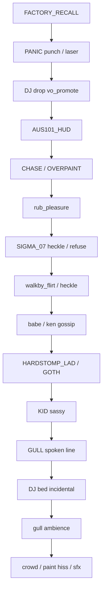

---

### 5.5 SFX — incidental Foley bank

SFX sit on a separate bus from VO. Commit encoded MP3s under `assets/sfx/`. Target folder **1.5–2.5 MB**. Prefer CC0; Mixkit/Pixabay only as End Product assets inside the game. Reject NC / personal-only / no-redistribution. Do not pull Sonniss GB dumps. Do not rip YouTube.

**Authoritative shopping list (not TBD):** [`docs/sfx-catalog.md`](docs/sfx-catalog.md) (synced from the SFX design part; parts copy may also live under `docs/parts/`). SFX1 **must** follow that file’s license policy, encode table, folder layout, and **Suggested first checkout** (30 files ≈ 1.0–1.4 MB). Paste its CREDITS.md block when landing. Do not re-shop from scratch.

**Hooks:** ocean / shore loops; gull cries + flaps; rain/storm; sand M/F + wet + boardwalk + chrome + chase + kids_run (non-vocal) footsteps; punch / shove / laser; lotion squeeze / rub / bottle; lighter / vape exhale; helicopter recall flyover (`world.heli`); radio static / UI ticks / station whoosh; splash / wave crash; wind palms; crowd boardwalk.

Encode: loops 32–48 kbps mono 22.05 kHz; one-shots 48–96 kbps. Cap concurrent one-shots at 8. Duck SFX −6 dB under VO.

### 5.6 Build (esbuild)

| Item | Contract |
|---|---|
| Bundler | **esbuild** via `scripts/build.mjs` |
| Entrypoint | `src/main.js` |
| Output | `dist/game.js` (IIFE or ESM single file) + `dist/index.html` (script tag / relative module) |
| Three | **r160** from `vendor/three/` **bundled into** `dist/game.js` (no CDN, no bare `importmap` to unpkg) |
| Assets | Copy/sync `assets/**` next to `dist/` (or `dist/assets/`); runtime URLs relative to the HTML origin |
| npm scripts | `"build": "node scripts/build.mjs"`, `"bake": "node tools/voice/bake.mjs"` (bake **not** invoked by `build`) |
| Bake isolation CI | Fail if `dist/game.js` matches `tiktokv.com`, `tools/voice/bake`, or `sessionid`. Grep paths: `dist/game.js`, `src/**` (src must not import bake). |
| lines transform | `build.mjs` (or small `scripts/emit-voice-manifest.mjs`) reads `tools/voice/lines.json` → writes `assets/voice/manifest.json` |
| Dev serve | Static host required for audio: e.g. `npx serve dist` or `python3 -m http.server` from repo root with correct asset paths |
| `file://` | Unsupported for full play (Goal Non-Goal #9) |

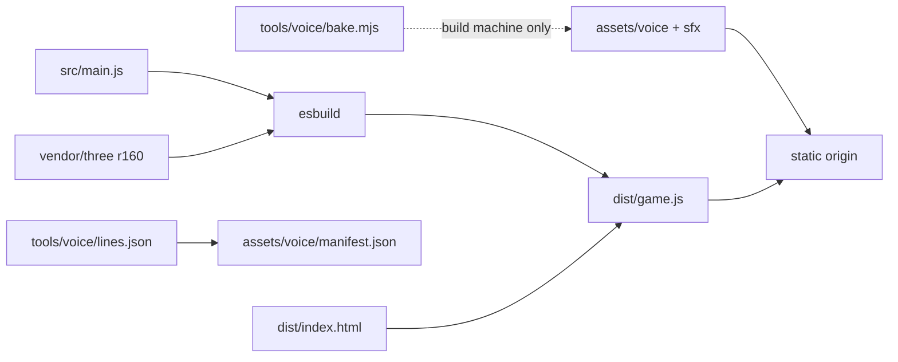

Folder layout:

```
assets/sfx/
  amb/     # ocean, shore_close, gulls, rain, storm, crowd_boardwalk, wind_palms, radio_static
  step/    # sand_m/f, sand_wet, boardwalk, chrome, chase, kids_run (3–5 variants)
  combat/  # punch, shove, laser, laser_fail
  foley/   # lotion_squeeze, lotion_rub, bottle_plastic, lighter, vape_exhale
  world/   # splash, wave_crash, gull_flap, heli
  ui/      # tick, whoosh, station_id
```

---

## 6. API / Interface Changes

Greenfield — no public API. Internal module contracts:

| Module | Export surface |
|---|---|
| `scripts/build.mjs` | esbuild `src/main.js` → `dist/game.js`; emit voice manifest; copy assets |
| `src/shell/viewport.js` | `onResize()`, `probeRects()`, never `new WebGLRenderer` after boot |
| `src/shell/poster.js` | Option B image + Option A tableau camera; Esc pause table |
| `src/world/lights.js` | frozen `LIGHTS` |
| `src/chars/*` | shared body primitives for poster + subjects (CHAR0) |
| `src/sim/rules.js` | frozen `RULES` (includes `swarmHullCap`) |
| `src/sim/paintPass.js` | WebGLRenderTarget paint; `paint(subject, stamp)`; readback |
| `src/player.js` | mover tick, `COL[]`, veil/pause |
| `src/vm.js` | `vm.drip()`, bottle mesh (before lotion PR) |
| `src/audio/radio.js` | Prev `[` / Pause `P` / Next `]` + mobile buttons |
| `src/audio/mix.js` | bus gains, apply/wanted duck, Key M |
| `src/audio/voiceCache.js` | LRU 16 decode |
| `src/audio/director.js` | distance gates, priority steal, ageBand + kid-proximity |
| Paint pick | excludes `KID`; ClothMask drives overpaint |

HUD chrome: 12-slot reticule bay; Reticule FM 101.7 transport; mute glyph; poster PLAY; tap-to-hear before first gesture.

---

## 7. Data Model

### Sim

- `RULES` constants (win thresholds, overpaint ml, bottle/hand ml, swarm timing/cap).
- Per-subject: maps (GPU for applying; CPU summaries otherwise), FSM state, `overpaintMl`.
- `Lotion`: `bottleMl`, `handMl`, rates.
- `world.wanted`, swarm lock timer.
- Reticule slots 0–11.
- Pause flags per Esc table.

### Dialog

- **Source:** `tools/voice/lines.json`.
- **Runtime:** `assets/voice/manifest.json` + MP3s.
- Fields: `id`, `text`, `voice`, `speaker`, `ageBand`, `tags[]`, `cooldownMs`, `gain`. Catalogs are tags.

### Audio / poster assets

- `assets/voice/<id>.mp3`, `assets/poster/og.webp`, `assets/synth/*.wav`, `assets/sfx/**/*.mp3`, optional `assets/mods/*`.
- `localStorage['aus101.mute']`.

### World

`COL[]` AABBs; band floor Y; prop instance list; shore-break ribbon state; `LIGHTS`.

---

## 8. Alternatives Considered

### A. Reskin Coconuts Ocean City as Australia

**Rejected.** Keep OC hotel/bar meshes and swap textures. Faster first screenshot, but the joke and the mover floor model fight each other (hotel loft vs tower), Maryland set dressing leaks, and r128 CDN remains. Decision: **port patterns from the Coconuts IIFE; rewrite into ES modules**; delete the OC level.

### B. Screen-space lotion decals

**Rejected.** Decals smear when the body turns; win condition becomes camera theater. Cost of UV unwrap pass is accepted so coverage is truth.

### C. Runtime TikTok / cloud TTS

**Rejected.** Legal (session cookie), latency, and static-host offline contract all die. Bake at build; commit MP3s. (Committed-MP3 ToS risk remains — see §9 / Open Questions.)

### D. Licensed Carpenter score or YouTube bed

**Rejected.** Copyright. Original D-minor sequencer + mandatory BBD chorus instead.

### E. Infinite spray / no bottle clock

**Rejected.** Deletes the drip system and the lose line “200 ml. That’s the joke.”

### F. Kids as optional paint targets with “safe” filters

**Rejected.** Collision set ≠ dialog set. Kids never enter ApplyPick.

### G. Dark instruction / click-start menu as first paint

**Rejected.** Small Start buttons and control paragraphs fail laserbarf.com / OG thumbnails (~160–400px). Poster-first boot is the brand surface; anywhere-click or giant PLAY unlocks.

### H. Static poster (Option B) as primary thumbnail; live tableau secondary — **accepted for v1**

**Accepted.** laserbarf `screenshots.php` → screenshotapi.com has no delay/WebGL wait; capture is **400×400**. Relying on live Option A for OG races `#0b1210`+placeholder. Trade-off: maintain committed `og.webp` **400×400** (CI/offline still from live tableau, composed for square center crop) while humans still get breathing Option A after CHAR0. Cost: art freeze discipline; Benefit: reliable thumbnails.

### I. Lower-fidelity coverage (vertex colors / single map) instead of UV R8 stack

**Deferred escape hatch, not v1 default.** Full UV R8 is the comedy truth (Key Decision: turning cannot fake a win). If PERF0 fails after material/readback mitigations (applying-only 256 RTT, 128 paint, Standard+albedo white-cast), allow a documented fallback: fewer maps or 128-only — still UV-space, not screen decals. Alternative of pure vertex tint rejected for the same smear reason as screen decals.

---

## 9. Security & Privacy

1. **No cross-origin runtime network.** No analytics, no accounts, no TTS API, no CDN scripts. Same-origin asset `fetch` only on the static host.
2. **Bake isolation.** `tools/voice/bake.mjs` must not be reachable from the game bundle. CI greps `dist/game.js` and `src/**` for `tiktokv.com`, `tools/voice/bake`, `sessionid`.
3. **Bake secrets.** TikTok `sessionid` (or successor) lives in env / secret store for bakers only — never git. Document in tools README.
4. **TikTok ToS / redistribution risk.** Unofficial API; confirm committed MP3s may ship under the game license; keep offline-TTS fallback path if bake is revoked (Open Question).
5. **Content safety.** CI: `child` + trope tags = fail. Banned-string test for real killer names / manifesto fragments on SIGMA_07 lines. **Runtime** kid-proximity director fixture (P4.5/P4.5b merge gate). No sexual content involving minors.
6. **localStorage** only for mute preference. No PII.
7. **Licenses.** Ship only CC0 / CC-BY / Mixkit-or-Pixabay End Product assets. `CREDITS.md` mandatory (Steve + SFX). Reject NC.
8. **XSS surface.** Static HTML; no user-generated HTML. Subtitles are text nodes from committed JSON/manifest.

---

## 10. Observability

Offline game — no telemetry pipeline. Dev / QA hooks only:

1. On-screen FPS / dt warning when `dt > 28 ms` for 20 frames (triggers quality drop).
2. Debug flag `?debug=1`: lotion ml, coverage mean/min, overpaint ml, active VO id, bus gains, readback ms, shadow map size.
3. Feature-detect log once: tracker vs carpenter; R8 vs RGBA; RG16F vs constant UvMetric.
4. CI: missing voice MP3 for referenced id; ageBand/trope fixtures; banned-name test; bake-not-in-bundle; **kid-proximity director fixture**; Option B poster fixtures present.
5. Unit test: apply duck depth on `GainNode` (≥ 6 dB).
6. PERF0 device log: readPixels stall median, physical-material frame cost.
7. Manual soak: two-source VO priority; gossip pair cooldown; Key M mute persists reload; Esc pause freezes UV/swarm.

---

## 11. Rollout Plan

1. **Build + W0 + POSTER0 + P1:** esbuild, Three **r160** pin, Steve-credited Coconuts vendor, Option B `og.webp`, `#0b1210` shell — static-host smoke.
2. **CHAR0:** shared cast primitives (AUS101, Ken, babe, SIGMA_07 shirt-on) before live poster or apply.
3. **POSTER1:** live tableau using CHAR0 meshes.
4. **W1–W3:** player port, bands, shore-break foam death.
5. **A0–A1:** audio context (poster tap) + Carpenter + chorus.
6. **BODY0 + bottle (ex-W7 early) + P2–P4:** placeholders + ClothMask, viewmodel bottle, ApplyRig, UV paint, lotion FSM.
7. **PERF0:** readback + materials gate on device (before more content).
8. **W4–W6 / A3–A5 / SFX1:** beach, film props, radio, DJ 53 files, Foley first-checkout.
9. **P5–P6 / P4.x / A6:** skin, reticule/fails, full dialog including gossip + ~200 NPC lines + SIGMA_07.
10. **Playable / content-complete / v1:** see milestone tags in §15.

No staged server rollout — ship is a git tag of `dist/` on laserbarf (or equivalent static host). Rollback = previous tag.

---

## 12. Open Questions

1. ~~Exact Three version pin~~ → **Resolved: Three r160** for W0/build (revisit only if iOS blocker).
2. ~~SPF kiosk buy refill~~ → **Resolved for v1: scenery-only** (no mid-run refill). Revisit post-v1.
3. Tracker pack: ship empty `assets/mods/` stub or defer entirely until after Carpenter A/B.
4. Gossip speakers: unify `WALKBY_BABE` / `beach_babe` enums vs alias map in director.
5. Optional InspectorJ CC-BY seaside bed — accept attribution string or stay CC0-only.
6. Phone-recorded lotion rub if CC0 stand-ins fail playtest — who owns the take / CC0 grant.
7. Win screen copy and credit roll length.
8. ~~KeyN night~~ → **Resolved: no KeyN.** Optional continuous `dayTime` + **`KeyT`** fast-forward leftover; noon default.
9. ~~Option B SLA~~ → **Resolved: Option B `og.webp` required for laserbarf v1 OG**; live Option A for humans after CHAR0. No WebGL-wait dependency on screenshotapi.
10. Default optional tagline copy (`I'LL BE BACK WITH SPF 50+` vs `TERMINATE UV`) or none.
11. **Risk:** TikTok bake ToS / right to redistribute committed MP3s; pick fallback TTS if bake dies.

---

## 13. References

- Repo: `/Users/wm/Desktop/repo/sunscreen`
- Coconuts: https://github.com/a-better-internet/coconuts
- TikTok voice bake tool: https://github.com/oscie57/tiktok-voice
- Kenney audio: https://kenney.nl/assets/category:Audio
- BigSoundBank: https://bigsoundbank.com
- OpenGameArt CC0 packs; Mixkit SFX Free License (End Product)
- Part sources (this draft merges): `grok-design-part-{systems,world,audio,npcs,dialog-extra,sfx,poster}-3641153d.md`
- SFX authoritative catalog: `docs/sfx-catalog.md` (from SFX part)
- Canonical design: `docs/DESIGN.md` / summary: `docs/SUMMARY.md`
- Repo README / CREDITS: Steve / Coconuts attribution (https://github.com/williamsharkey/aus101)
- laserbarf screenshots: no WebGL wait (screenshotapi `url/width/height/fresh` only)

---

## 14. Key Decisions

1. **Poster-first boot + Option B required for laserbarf v1 OG.** Committed `og.webp` at **400×400** (laserbarf square) for thumbnails (screenshotapi has no WebGL wait). Humans get live Option A after CHAR0 + huge 2D `AUS101`; tap/PLAY unlocks; `#0b1210` under; Esc → pause table. No dark instruction menu. Canonical design path: `docs/DESIGN.md`.
2. **Static-host ship contract.** esbuild bundles JS+Three r160; audio via same-origin `fetch`. `file://` not supported for full play.
3. **Coverage is UV-space via WebGLRenderTarget** (R8/RGBA), applying-subject 256 resident; not screen decals; FramebufferTexture non-normative.
4. **`100vh` + `innerHeight`, never `100dvh`, never recreate WebGL** after boot.
5. **Finite 200 ml / 4–6 ml hand;** bottle viewmodel before lotion FSM. The bottle is the clock.
6. **Punch and laser are first-class lose conditions, but only on contact.** Superseded the original instant-on-keypress rule: pressing the key is not the crime, hurting someone is. Swing and ray both hit-test; harm escalates ALERT → RECALL; ≤8 heli hulls fly in and must physically reach you + recall/panic VO + heli SFX.
7. **ClothMask is a paint reject for coverage, not a pick reject** — painting trunks triggers chase.
8. **Port Coconuts patterns (Steve); rewrite ES modules; delete the OC level.** Not “extract modules” from the IIFE. Vendor/bundle Three r160; no r128 CDN.
9. **Noon is the product.** Optional continuous `dayTime` + **`KeyT`** fast-forward leftover — **no KeyN**.
10. **Foam dies on wet sand** — the nearer Australian shore-break rule.
11. **Bake TTS, commit audio;** one `tools/voice/lines.json` source → manifest. Runtime has no network voice path.
12. **`carpenter.js` ships with stereo BBD chorus** (0.6 Hz, 8–12 ms). Tracker optional with iOS fallback.
13. **Radio is 2D (Prev/Pause/Next); NPCs are 3D; beds stay under.** Apply/wanted duck radio. Key M hard-mutes.
14. **Age band is data + runtime kid-proximity fixtures.** Kids not paint targets. Gull ≠ child.
15. **SIGMA_07 is a cloth-masked heckler.** Shirt on. SIGMA_07 / Trevor from the forum. No real killer names. No manifesto.
16. **Everyone is mocked.** Adult vanity / Ken gossip is `ageBand: adult` only.
17. **SFX ≤ 2.5 MB, CC0-first;** authoritative catalog = SFX part file; CREDITS.md (Steve + SFX) mandatory.
18. **Restart clears maps, keeps the GL context.**
19. **White-cast + erythema carry the tutorial.** No popup. Red and zinc. `LIGHTS` single table in `src/world/lights.js`.
20. **80 × 50 m world budget; PERF0 early; swarm capped; applying-only full RTTs.**
21. **CHAR0 / BODY0 before POSTER1 and P2–P4.** Shared meshes first.

---

## 15. PR Plan (unified ordered PRs)

Land in this order. Gates: no chase before real `CoverageMap`; no voice catalogs if bake is in the game bundle; no Carpenter without BBD chorus; no SIGMA_07 without banned-string test; no rub without child-collider reject; **no POSTER1 before CHAR0**; **no P2–P4 before BODY0**; **no P4 lotion before bottle viewmodel**; **PERF0 after P3** before piling content.

| PR | Scope | Done when |
| --- | --- | --- |
| **BUILD0** | `package.json`, `scripts/build.mjs` (esbuild), Three **r160** vendor path, `npm run build` → `dist/index.html` + `dist/game.js` (Three bundled), asset copy, bake-isolation CI greps | Static-host open shows blank/`#0b1210` canvas; `dist/game.js` has no `tiktokv.com` / bake |
| **W0** | Vendor Coconuts snapshot + NOTICE (Steve); noon sand via `LIGHTS`; list symbols ported vs rewritten | Static host lit ground; no CDN; CREDITS/README credit Steve |
| **POSTER0** | Option B `assets/poster/og.webp` **400×400 required**; `#0b1210`; giant `AUS101` overlay; optional one tagline + PLAY; tap unlock; Esc pause table stub; 400×400 + 160/240/400 fixtures; gate dark start menu | Cold load shows static poster; **400×400** square silhouette pass; laserbarf OG does not depend on WebGL wait |
| **P1** | Shell viewport meta, `100vh`, safe-area, DPR cap, never recreate GL; poster root under shell | iPhone rotate keeps context; poster still first paint |
| **CHAR0** | Shared `src/chars/` primitives: AUS101 chrome, Ken-jock, beach babe, SIGMA_07 long-sleeve; silhouette-distinct | Four meshes render in isolation; usable by poster + subjects |
| **POSTER1** | Live `PosterScene` using CHAR0; wind/eye/dolly; same renderer | ~300px human view: title + four silhouettes; no second art fork |
| **W1** | Port player + `COL[]`, walls, bob, veil/pause, lock | WASD + Shift 3.4/6.4; stay in 80 × 50 |
| **A0** | `audio/context.js` — resume on poster tap, Key M, master gain | mute survives reload |
| **W2** | Bands: boardwalk, stairs, dry/wet, wade; floor AABBs | Deck → sand → wet, no fall-through |
| **A1** | `carpenter.js` + chorus + oscillator fallback | iPhone D-minor pulse after tap |
| **W3** | Shore-break + foam death; retune ocean | Dump Z=36; no dry-sand foam |
| **BODY0** | 12 slot placeholder bodies + ClothMask atlases + ApplyPickLayer; kids excluded from pick set | Ray hits body vs cloth; KID collider rejected |
| **VM0** | `vm.js` bottle + palm **before lotion** (was late W7) | Bottle ray / hold pose exists; bob works |
| **P2** | `FrameInput`, joystick, PlayCamera / ApplyRig | Space on BODY0 mesh orbits; release 180 ms returns |
| **P3** | UV unwrap WebGLRenderTarget maps, aniso stamp, 64×64 readback (applying-only 256) | Orbit keeps film in UV; trunks do not raise coverage |
| **PERF0** | Measure readback stall + physical skin cost on iPhone; quality-drop hooks; shadow 1024/512 | Documented numbers; drop path wired; gate further content if floor missed |
| **P4** | Lotion FSM using VM0 bottle: 200 ml, 4–6 ml hand, drip | Empty bottle before 12 bodies is a lose |
| **A2** | `assets/synth/*` + sample path | A/B vs oscillators; CREDITS licences |
| **W4** | Beach prop ports + scatter; noon `LIGHTS` | Reads as beach from spawn |
| **A3** | Radio Prev/Pause/Next + mobile buttons | Transport OK while muted |
| **W5** | Kiosk + tower (scenery; no refill v1) | Tower Y=4.8; kiosk blocks |
| **A4** | `tools/voice/bake.mjs` + `lines.json` SoT + manifest emit + CI missing-file; sessionid secret docs | bake never imported from `src/`; manifest emitted |
| **SFX1** | Follow SFX part **first-checkout table** (~30 files) | `assets/sfx/` ≤ 2.5 MB; heli/punch/laser/lotion present; CREDITS pasted |
| **W6** | `film.js` placements; radios on mute graph | Seven prop types |
| **P5** | Skin shader under `LIGHTS`; white-cast; erythema | Unpainted reddens; zinc reads |
| **A5** | **53** DJ MP3s: open + 49 quips + 3 song announces; bag shuffle | Ids match §5.3 count |
| **P4.1** | Schema + empty director on `tools/voice/lines.json` | child+trope fixture fails |
| **P4.2** | HUD + recall VO | Recall preempts HUD |
| **P6** | Reticule + fails; wanted sequence (panic/recall, heli SFX, ≤8 hulls, game-over card) | F/G or 2-/3-finger → swarm 2.4 s |
| **P4.3** | Gull + kid lines | gull ≠ child; kids not in paint set |
| **A6** | ~200 NPC lines, LRU 16, panner, priority | panic beats DJ; gull never steals |
| **P4.4** | Lad + goth (CHAR0 variants / unique meshes) | 12+10; Flume id-stable |
| **A7** | Mix: ocean/crowd, apply/wanted duck, slasher stem, sfx duck | duck depth unit-tested |
| **P4.5** | Babe/jock + rub/flirt/heckle + **kid-proximity fixture** | rub needs adult contact; KID in radius suppresses |
| **P4.5b** | Babe gossip 20 + Ken 20 + cross-talk 8 + bit-parts + kid-proximity | adult-only; 6 m / 8 m gates |
| **P4.6** | Overpaint / chase / panic lines | panic preempts walk-by |
| **P4.7** | SIGMA_07 | Shirt-on; 16 incel lines; banned-name test |
| **P4.8** | DJ priority vs dialog | DJ drop > gull VO |
| **A8** | Optional tracker + iOS fallback | feature-detect logged once |
| **DAY?** | Optional continuous dayTime + **KeyT** (not KeyN) | Noon remains default if shipped |
| **PERF1** | Final triangle/draw audit; swarm 4 drop; tracker off | 30 Hz floor iPhone 13 hidden URL bar |

**Milestone tags:**

- `poster-boot` — after BUILD0+POSTER0+P1
- `playable-beach` — after W3+A1
- `playable-apply` — after BODY0+VM0+P4+PERF0
- **`content-complete`** — after **A6 + P4.5b + P4.7 + A5 + SFX1** (and BODY/paint already landed)
- `v1` — after PERF1 + license/CI green + Option B fixtures + Steve CREDITS

## 16. Risks

| Risk | Severity | Mitigation |
|---|---|---|
| screenshotapi captures empty GL | high | Option B `og.webp` required |
| `file://` fetch fails for VO | high | Static-host contract; drop file:// goal |
| readPixels stalls iPhone | high | PERF0 early; applying-only RTT; interval/size drop |
| TikTok bake ToS / API death | medium | secrets out of git; offline TTS fallback OQ |
| MeshPhysicalMaterial cost ×12 | medium | applying-only physical; Standard+albedo escape |
| Swarm instance spike | medium | `swarmHullCap` 8 → 4 on quality drop |
| Coconuts IIFE rewrite underestimation | medium | W0 symbol list; pattern-port language |
