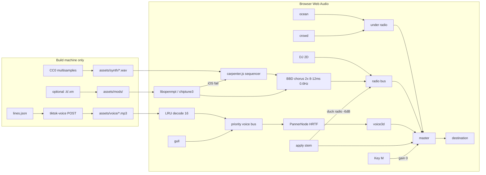
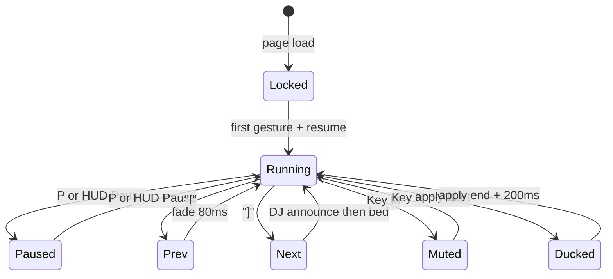

# Part 3 — Audio

Self-contained Three.js client. No game server. All sound is files on disk plus Web Audio. Nothing phones home at play time.

## 3.1 Policy: TikTok TTS is a build tool

Voice lines come from [oscie57/tiktok-voice](https://github.com/oscie57/tiktok-voice). That repo POSTs `https://api16-normal-v6.tiktokv.com/media/api/text/speech/invoke/` with a session cookie. **Build machine only.** The shipped game never imports that client, never holds a sessionid, never hits `tiktokv.com`.

Pipeline:

1. Author `tools/voice/lines.json` — id, text, voice, category, priority.
2. `node tools/voice/bake.mjs` reads the sheet, POSTs TikTok, writes `assets/voice/<id>.mp3`.
3. Commit the MP3s. CI fails if a line id is referenced and the file is missing.
4. Runtime loads `assets/voice/<id>.mp3` through `fetch` + `decodeAudioData`. That is it.

Allowed bake voices (exact TikTok keys):

| Key | Use |
|---|---|
| `en_au_001`, `en_au_002` | Gold Coast NPCs, Radio DJ default |
| `en_us_001`, `en_us_002`, `en_us_006`, `en_us_007`, `en_us_009`, `en_us_010` | Tourists |
| `en_uk_001`, `en_uk_003` | Poms on holiday |
| `c3po`, `stormtrooper`, `rocket`, `stitch` | Spice / costume gags |
| `en_male_funny` | Comic walk-bys |
| `en_female_emotional` | Protest / plea |
| `en_male_narration` | Alt DJ + slasher-close sting VO |

DJ voice: `en_au_002` first. Fallback bake: `en_male_narration` then a one-pole AM chain at bake time (HPF 180 Hz, 2.8 kHz peak +4 dB, LPF 4.2 kHz, 50 Hz hum −28 dB). Do not run that EQ live; store the processed MP3.

Budget: ~200 NPC lines + 50 DJ quips. Encode **32 kbps mono MP3**. Target folder size ≤ 4 MB.

Runtime decode: LRU cache of **16** decoded `AudioBuffer`s (`src/audio/voiceCache.js`). Miss evicts the least-recent idle clip. Never decode on the main thread during a 60 fps frame; queue behind `requestIdleCallback` or a microtask after the current render.

3D: `PannerNode` HRTF, `refDistance` 4 m, `rolloffFactor` 1.2, max 28 m. Listener follows the camera. DJ and music are 2D (no panner).

Priority, high wins, one voice bus:

`panic > protest > rub > walkby > DJ > gull`

A higher line ducks or steals the voice bus. Same-or-lower waits or drops. Gulls never steal.

## 3.2 Station: Reticule FM 101.7

The HUD radio is the only licensed-feeling object in the mix. Brand: **Reticule FM 101.7**. Call letters on the chrome bezel. Subline: “Gold Coast / after dark.”

Transport:

| Action | Desktop | Mobile |
|---|---|---|
| Prev | `[` | tiny safe-area button, left of Pause |
| Pause / play | `P` | centre button |
| Next | `]` | right button |
| Volume | mouse on HUD slider; keys `-` / `=` optional | vertical drag on the three-button cluster |

Mobile buttons sit in the bottom-safe inset, 28×28 CSS px, 8 px gap, never over the apply reticle. They only appear when the radio HUD is expanded (tap the frequency badge).

DJ contract:

- Cold open after first unmute: *“it’s a beautiful day on the Gold Coast.”* (line `dj_open_01`)
- Announce every song change: artist-free title plus one flavour clause.
- Between tracks, pull a quip from the 50-line catalog. No repeat until the bag is empty. Seed from `performance.now()` so two tabs do not lock-step.

### Catalog — 50 DJ lines (commit as MP3s)

Bake voice `en_au_002`. Prefix `dj_`. Copy is locked; do not paraphrase at bake time.

1. `dj_open_01` — it’s a beautiful day on the Gold Coast
2. `dj_quip_01` — Reticule FM 101.7, still on the air, still pretending the sun is your friend
3. `dj_quip_02` — if your skin is already pink, that is not a tan, that is a warning
4. `dj_quip_03` — coming up: more songs, more glare, fewer good decisions
5. `dj_quip_04` — this next one is for anyone hiding under a towel like it is architecture
6. `dj_quip_05` — remember, zinc is a lifestyle, not a suggestion
7. `dj_quip_06` — traffic on the highway is fine; traffic on the sand is you
8. `dj_quip_07` — we play the hits so you do not have to think about the UV index
9. `dj_quip_08` — shout-out to the bloke who brought a whole esky and no hat
10. `dj_quip_09` — 101.7, where the chorus hits harder than the two o’clock sun
11. `dj_quip_10` — if you can hear the gulls over me, turn me up, not them
12. `dj_quip_11` — Gold Coast weather: bright, brutal, and not taking questions
13. `dj_quip_12` — this is your captain speaking; the captain is a radio and he is not sorry
14. `dj_quip_13` — apply, reapply, then apply again like you mean it
15. `dj_quip_14` — we do not do request hours; the ocean already requested your hat
16. `dj_quip_15` — next track is colder than the change rooms and twice as honest
17. `dj_quip_16` — Reticule FM, broadcasting from somewhere you should not nap
18. `dj_quip_17` — if your shoulders are glowing, that is not aura, that is physics
19. `dj_quip_18` — hold your kids, hold your keys, hold your SPF
20. `dj_quip_19` — this one goes out to the last bottle of 50-plus on the whole strip
21. `dj_quip_20` — you can mute me; you cannot mute the sun
22. `dj_quip_21` — 101 point 7, slightly out of tune on purpose, like a holiday
23. `dj_quip_22` — the forecast is: more forecast
24. `dj_quip_23` — I have seen that rash shirt before; it did not win last time either
25. `dj_quip_24` — stay with us through the heat shimmer; we are not going anywhere
26. `dj_quip_25` — if you came for talkback, wrong decade, wrong station, right beach
27. `dj_quip_26` — spinning another one before the tide takes the speaker
28. `dj_quip_27` — sunscreen first, opinions later
29. `dj_quip_28` — this is the part of the afternoon where everyone becomes a lizard
30. `dj_quip_29` — Reticule FM: less chat, more shade
31. `dj_quip_30` — I will be here when the umbrellas fail
32. `dj_quip_31` — next up, something with a pulse and no UV
33. `dj_quip_32` — do not look directly at the water; it is showing off
34. `dj_quip_33` — 101.7, for people who packed snacks and forgot water
35. `dj_quip_34` — the boardwalk is a runway and nobody rehearsed
36. `dj_quip_35` — keep your radio close; the gulls are unionising
37. `dj_quip_36` — we interrupt this sunshine for more sunshine
38. `dj_quip_37` — if you are listening in a car park, stay in the car park
39. `dj_quip_38` — that smell is coconut, panic, and chips
40. `dj_quip_39` — Gold Coast after lunch: the real boss fight
41. `dj_quip_40` — I am not your dad; I am louder than your dad
42. `dj_quip_41` — Reticule FM 101.7, still legal, still sticky
43. `dj_quip_42` — one more song, then you reapply, then one more song
44. `dj_quip_43` — the tide chart lies; the burn does not
45. `dj_quip_44` — this next cut is for the towel that will never be the same
46. `dj_quip_45` — we fade, we do not ghost
47. `dj_quip_46` — if the sky looks empty, that is the point
48. `dj_quip_47` — stay hydrated or stay home; I cannot do both for you
49. `dj_quip_48` — 101.7, coming at you from the wrong side of the umbrella
50. `dj_quip_49` — beautiful day, terrible idea, perfect radio
51. `dj_song_fmt` — that was {title}; this is {title}; do not take that as medical advice

Line 51 is a template. Bake three concrete fills at build (`dj_song_01`…`03`) from the first three bed titles. Runtime concatenates only those baked files — no live TTS.

## 3.3 John Carpenter 80s bed (must-ship)

File: **`src/audio/carpenter.js`**. Ships in the first playable build. Must start on a cold iPhone (Safari, silent-switch respected, AudioContext resume on first gesture). No Carpenter scores. No YouTube rips. Original sequence only.

Musical box:

- Key **D minor**. Tempo **108–118 BPM** (default 112). One `Transport` clock: `currentBeat = (ctx.currentTime - start) * bpm / 60`.
- Pulse bass: eighths on D1/D2, ghost on the off-beat, octave jump every 8 bars.
- Rim on 2 and 4. Occasional tom fill bar 15.
- **Slasher-close apply stem**: a high D / A cluster that only arms when the player starts an apply. 900 ms swell, hard cut on release.

Juno-106 character (do not skip):

- DCO: saw or square, slight analog drift ±4 cents, optional PWM on pads.
- Filter envelope **swells**, not plucks. Attack 180–400 ms on pads, 8–20 ms on bass. Sustain high. Release 300 ms.
- **Stereo BBD chorus is mandatory** on pads (and on the optional tracker master). Two delay lines, LFO **~0.6 Hz**, delay **8–12 ms**, opposite phase, mix 35–45%. Implement as two `DelayNode`s + two `OscillatorNode` LFOs into `delayTime`, then a mid/side sum. No “chorus = slight detune and hope.”

Decent sound set — commit **~400–800 KB** 16-bit WAV under `assets/synth/`:

| File | Notes |
|---|---|
| `juno_saw_c2.wav` | loopable, 16-bit, one shot or 2-bar |
| `juno_saw_c3.wav` | |
| `juno_saw_c4.wav` | |
| `juno_square_c3.wav` | bass / lead |
| `juno_pwm_pad.wav` | seamless loop |
| `pink.wav` | wind / tape hiss bed |
| `rim.wav` | |
| `tom.wav` | |

Licence: **CC0 or CC-BY only**. Name the source in `CREDITS.md`. If a sample cannot be licensed, **do not ship silence**. Fall back in the same file: `OscillatorNode` saw/square + the **same** chorus graph + generated pink (`ScriptProcessor` is banned; use a short noise buffer).

Optional tracker pack: 4–8 `.it` / `.xm` in `assets/mods/`, 16-bit samples **inside** the module. Play with chiptune3 or libopenmpt, **windowed-sinc** interpolation. Route the tracker output through the **same** Juno chorus on the master. iPhone may fail WASM compile or AudioWorklet; then drop to `carpenter.js` sequencer. Feature-detect once, cache the choice.

## 3.4 Mix

Buses (all `GainNode`, linear ramps 30–80 ms):

| Bus | Default | Rule |
|---|---|---|
| `ocean` | −16 dB | always under |
| `crowd` | −18 dB | always under |
| `radio` | −8 dB | DJ + beds + tracker |
| `voice3d` | 0 dB | NPC panners |
| `apply` | 0 dB | slasher stem |
| `gull` | −20 dB | lowest priority |
| `master` | 0 dB | KeyM target |

Rules:

- Ocean and crowd sit **under** the radio. Never sidechain them to the DJ.
- **Apply ducks radio −6 dB** for the duration of the rub plus 200 ms release. Voice3d is not ducked; panic still cuts through.
- **Key `M` mutes all** — `master.gain` to 0. Second tap restores the last non-zero. Persist in `localStorage` key `aus101.mute`. iOS silent switch still wins.
- First user gesture calls `audioCtx.resume()`. Before that, HUD shows a tap-to-hear glyph. Do not autoplay.

## 3.5 Graph and transport





## 3.6 Key decisions

1. **Bake TTS, commit audio.** Runtime has no network voice path. Legal and latency both die if we “just call TikTok in the client.”
2. **One sequencer ships.** `carpenter.js` is not a stretch goal. Tracker is optional flavour with an iOS fallback to that same sequencer.
3. **Chorus is a product requirement.** A dry saw stack is not a Juno. Two delays, 0.6 Hz, 8–12 ms, or the bed is rejected in review.
4. **Samples if licensed, oscillators if not.** Never block the milestone on a sample pack. CREDITS.md is mandatory either way.
5. **Radio is 2D, NPCs are 3D, beds stay under.** Apply is the only duck. Key M is the only hard mute.
6. **32 kbps mono + 16-buffer LRU.** Voice is texture, not album quality. Decode budget is a frame-time budget.
7. **No Carpenter, no YouTube.** Original sequence. If it sounds like *Halloween*, rewrite the riff.

## 3.7 PR slices

| PR | Ships | Done when |
|---|---|---|
| **A0** | `src/audio/context.js` — create, resume-on-gesture, Key M, master gain | mute survives reload |
| **A1** | `src/audio/carpenter.js` + chorus + oscillator fallback | iPhone plays D-minor pulse after tap, no samples |
| **A2** | `assets/synth/*` 400–800 KB + sample path | A/B vs oscillators; CREDITS.md lists licences |
| **A3** | Radio HUD Prev / Pause / Next + `[` `]` `P` + three mobile buttons | transport works with master muted (no visual desync) |
| **A4** | `tools/voice/bake.mjs` + `lines.json` schema + CI missing-file check | bake never imported from `src/` |
| **A5** | 50 DJ MP3s + bag shuffle + `dj_open_01` + three song announces | catalog ids match §3.2 |
| **A6** | 200 NPC lines, LRU 16, panner, priority steal | panic beats DJ; gull never steals |
| **A7** | Mix: ocean/crowd buses, apply −6 dB duck, slasher stem | duck depth measurable in a unit test on `GainNode` |
| **A8** | Optional tracker pack + sinc interpolate + same chorus + iOS fallback | feature-detect logged once |

Do not merge A5 or A6 if bake code is reachable from the game bundle. Do not merge A1 without the stereo BBD chorus.

## 3.8 File map

```
src/audio/context.js
src/audio/carpenter.js
src/audio/chorus.js
src/audio/voiceCache.js
src/audio/radio.js
src/audio/mix.js
tools/voice/bake.mjs
tools/voice/lines.json
assets/voice/*.mp3
assets/synth/*.wav
assets/mods/*.it          # optional
CREDITS.md
```
