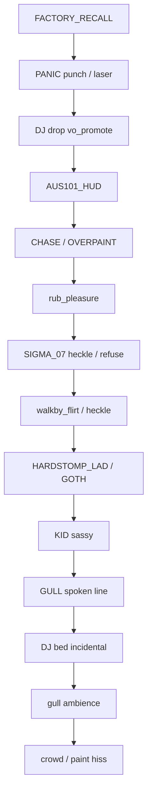

# Part 4 — Dialog + NPC Archetypes

Schema, age-band lock, ten archetypes, starter catalogs, two-channel director. INCEL is satire: SIGMA_07 / "Trevor from the forum". Never a real killer name. Never manifesto text. Kids ambient, not paint targets. Gulls are birds. Adult tropes stay on `ageBand: adult`.

## 4.1 Line schema

`src/audio/lines.json` is a flat array. One object per bark. No runtime concat.

```json
{
  "id": "goldcoast.flume.01",
  "text": "hey chrome boy, you don't know where I can get some Flume tickets",
  "voice": "lad_goldcoast_01",
  "speaker": "HARDSTOMP_LAD",
  "ageBand": "adult",
  "tags": ["walkby", "gold_coast_lad", "music"],
  "cooldownMs": 18000,
  "gain": 0.85
}
```

| Field | Rule |
| --- | --- | --- |
| `id` | `{catalog}.{slug}.{nn}`, stable |
| `text` | spoken + subtitle, no markup |
| `voice` | bank id → WAV folder |
| `speaker` | archetype enum, §4.3 |
| `ageBand` | `adult` \| `child` \| `gull` \| `system` |
| `tags` | catalog + mood; tropes adult-only |
| `cooldownMs` | per-id floor |
| `gain` | 0.2–1.0; HUD 0.7; gulls 0.45 |

Speakers: `HARDSTOMP_LAD`, `GOTH`, `WALKBY_BABE`, `WALKBY_JOCK`, `OVERPAINT`, `CHASE`, `PANIC`, `GULL`, `KID`, `AUS101_HUD`, `FACTORY_RECALL`, `SIGMA_07`. Catalog tags match §4.4. Mood: `music`, `drink`, `rub`, `paint_refuse`, `iamverysmart`, `public_health`.

**CI test:** trope tags cannot attach to `child`. `rub_pleasure` / `walkby_flirt` / `incel` / adult sex-or-drink tropes require `ageBand: adult`. `child` + trope = fail. Gulls are `gull`, never `child`. Paint resolver never returns a `KID` collider.

## 4.2 Hard rules

1. Adult 80s tropes and sexualized jokes only on `ageBand: adult`.
2. Children ambient, not paint targets. Sassy, kid-safe. No drink, sex, forums, violence.
3. Gulls are not children. `speaker: GULL`, `ageBand: gull`.
4. SIGMA_07 is satire, not a real killer. Name: `SIGMA_07` / "Trevor from the forum". **Never name Elliot Rodger. Never quote a manifesto.** Shirt stays on. ClothMask almost all cloth — maybe face/hands. Walk-by heckle or paint-refuse. Not a violence fantasy. Factory Recall still fires if anyone is hurt.
5. One VO + one incidental. HUD, recall, spoken NPC share VO. Gull flaps, crowd, paint hiss share incidental. No double-book.

## 4.3 Archetypes

Unique mesh + walk-by bank. Voice banks do not share bodies.

**1. Hardstomp lad — `HARDSTOMP_LAD`.** Die-dyed blonde, shark-tooth necklace, shirtless, boardies. Flume, Kylie, Sia, Tame Impala, Fisher, Hardstomp, Lost Paradise, Surfers boat party, drinking idiots. Signature: *"hey chrome boy, you don't know where I can get some Flume tickets"*.

**2. 80s goth / outsider — `GOTH`.** Black linen, cig, boots in sand. Signatures: *"what does it all mean?"* / *"nothing matters anyway"* / *"hey don't you ever get bored of being people's slaves, here try my cigarette"*.

**3. Walk-by babes / jocks — `WALKBY_BABE`, `WALKBY_JOCK`.** Camp 80s adult tropes. "nice abs, clanker". "are you *fully* functional". Rub: "mmm that feels so good". Adult only. Meshes: high-cut one-piece / neon windbreaker; tank + short-shorts.

**4. Overpaint + chase — `OVERPAINT`, `CHASE`.** Sandwich board + megaphone vs visor, whistle, council vest. Adult.

**5. Punch / laser panic — `PANIC`.** Any adult mesh. Punch or laser, not walk-by.

**6. Seagulls — `GULL`.** Not children. Camp birds. *"ima bird kid, just flyin outta here"*. Tag `gull`, never `child`.

**7. Kids — `KID`.** Ambient. Not paint targets. Sassy only. Rashie + bucket hat. *"hey whatcha lookin at? never seen a kid before??"*

**8. AUS101 HUD — `AUS101_HUD`.** Deadpan terminator public-health VO. `ageBand: system`.

**9. Factory T-101 recall — `FACTORY_RECALL`.** Interrupts everything but itself. Fires if anyone is hurt. Four director lines. Not comedy.

**10. INCEL — `SIGMA_07`.** Satire. "Trevor from the forum". Long-sleeve black graphic tee, cargos, socks-and-sandals. **Shirt stays on.** ClothMask almost all cloth. Incel tropes + `/iamverysmart`. Walk-by heckle / paint-refuse. Not a violence fantasy. Recall still fires if anyone is hurt.

## 4.4 Starter catalogs

Concrete `text` fields. `id` = `{catalog}.{slug}.{nn}`. Default `cooldownMs`: walk-by 14000, rub 8000, heckle 16000, HUD 12000, gull 9000, child 20000, incel 22000, panic 6000.

### rub_pleasure — 12 — `ageBand: adult` — `WALKBY_BABE` / `WALKBY_JOCK`

1. mmm that feels so good
2. keep going chrome, right there
3. oh you are *fully* functional
4. don't you dare stop, clanker
5. that's the spot, that's the spot
6. who taught a T-unit to give a rubdown
7. harder, terminator, I paid for this tan
8. if this is a firmware test I pass
9. your hands are cold and I am not complaining
10. do the shoulders again, metal man
11. I am going to tell everyone on Cavill you do this
12. okay wow, okay, stay in that loop

### walkby_flirt — 12 — `ageBand: adult`

1. nice abs, clanker
2. are you *fully* functional
3. hey chrome, you come here often or do you just wash up
4. those arms could bench the whole strip
5. leave some shine for the rest of us
6. if I said oil me would that be a warranty issue
7. you look like the sequel and I watched the first one twice
8. walk with me, I'll buy you a Solo
9. is that a plasma rifle or are you just happy to patrol
10. I'd let you protect me from the future
11. smile if your mouth even does that
12. save me from these mortals, chrome boy

### walkby_heckle — 10 — `ageBand: adult`

1. nice paint job, toaster
2. go oil yourself, clanker
3. who let Skynet on the Esplanade
4. you here to take our jobs or just our sunscreen
5. beep beep, rust bucket
6. my fridge has more personality
7. chrome doesn't make you a local
8. put a shirt on — wait, you don't even have skin
9. terminator's lost, somebody point him at Brisbane
10. if you're the future I'm moving inland

### gold_coast_lad — 12 — `ageBand: adult` — `HARDSTOMP_LAD`

1. hey chrome boy, you don't know where I can get some Flume tickets
2. bro if Fisher drops at Hardstomp I'm sleeping on the sand
3. you been to Lost Paradise or are you just a Surfers tourist unit
4. Kylie's doing a secret set, I can feel it in me teeth
5. Sia would smash this beach, no face, all vibe
6. Tame Impala at the boat party and I'm not coming home
7. mate I drank the whole slab, the slab drank me back
8. chrome boy you want a midstrength or are you union
9. shark tooth's real, I pulled it off a vending machine in Broadbeach
10. don't paint me bro I just dyed this blonde for the weekend
11. Surfers boat party, no shirt, no plan, no liver
12. if you're not on the Hardstomp shuttle you're not on the guest list

### goth — 10 — `ageBand: adult` — `GOTH`

1. what does it all mean?
2. nothing matters anyway
3. hey don't you ever get bored of being people's slaves, here try my cigarette
4. the sun is a lie we all agreed to
5. I came to the beach to feel worse and it's working
6. your chrome is just another costume, same as this linen
7. smoke's the only honest weather
8. they will oil you and still call it love
9. I lit this for the void, you can have the next one
10. stop shining, some of us are trying to fade

### child_sassy — 8 — `ageBand: child` — `KID`

Kid-safe. No tropes. Not a paint target.

1. hey whatcha lookin at? never seen a kid before??
2. my mum said don't talk to chrome people but you started it
3. you walk funny, like a fridge on holiday
4. I had a robot at Christmas, he was shorter
5. stop staring, I can do that too, see
6. if you're lost the ice cream is that way
7. I'm not sharing my chips, get your own
8. are you even allowed on this beach without a grown-up

### gull — 10 — `ageBand: gull` — `GULL`

Gulls are not children.

1. ima bird kid, just flyin outta here
2. that's my chip, that's always been my chip
3. I pay no rent and I fear no ranger
4. squawk means mine, also mine, also that one
5. you can't ticket a seagull, I checked
6. I invented stealing, you're just the sequel
7. beach is a plate and I am the fork
8. if it flakes it flies, that's the law
9. I don't do queues, I do vertical
10. your hair is a nest and I am considering it

### aus101_hud — 12 — `ageBand: system` — `AUS101_HUD`

1. SPF reminder. Reapply. The sun does not negotiate.
2. Hydration advisory. Salt water is not a drink.
3. Crowd density acceptable. Do not become the crowd.
4. UV index hostile. Shade is a tactic.
5. Slip, slop, slap. This unit complies.
6. Marine stinger season. Look, then step.
7. Alcohol and heat compound. Reduce both.
8. Lost child protocol is not your protocol. Scan, do not pursue.
9. Sunscreen on the lens is operator error.
10. You are a public-health appliance. Act like one.
11. Skin is temporary. Chrome is leased.
12. Mission remains: coat the living. Do not coat the children.

### incel — 16 — `ageBand: adult` — `SIGMA_07`

Satire. Shirt on. Heckle / refuse. Incel tropes + `/iamverysmart`. No real name. No manifesto.

1. you plebeians are not even equipped to understand the quantum beauty underlying the most genius foundations of my theory of everything
2. Chads and Staceys will never understand me
3. another Stacey choosing the chrome Chad
4. you serve the foids, clanker
5. my tensor calculus of attraction predicts this outcome to six sigma, obviously
6. I have a 168 verbal and a body that refuses to perform for the market
7. the Lagrangian of this beach is just Chad potential plus Stacey kinetic, trivial
8. I posted the proof on the forum, Trevor saw it, you wouldn't
9. paint me and you still won't raise my perceived mate value, that's not how the Hamiltonian works
10. she looked at you because you are reflective, not because you have a mind
11. I am mid-sequence on a grand unified theory of why no one texts back
12. cargo shorts are optimal, sandals maximize ground truth, the shirt stays on as a boundary condition
13. you think abs are ontology? read a book, clanker
14. SIGMA_07 does not queue for ice cream, SIGMA_07 queues for being correct
15. if you understood Gödel you'd understand why I can't talk to jocks
16. walk-by refusal logged: this chassis is not for your little chrome ritual, try the Chad

Others may say "Trevor from the forum". He only says SIGMA_07.

### overpaint / chase / panic — 10 — `ageBand: adult`

1. STOP THE CHROME — this beach is a people place (`overpaint`)
2. you already painted that man, look at him, he's a stripe (`overpaint`)
3. I will chain myself to this shower block (`overpaint`)
4. council says no, unit, council says no (`chase`)
5. drop the can and walk, metal (`chase`)
6. I have a whistle and a radio and I will use both (`chase`)
7. he shot a laser, he shot a laser on the beach (`panic`)
8. that's a fist, that's a real fist, run (`panic`)
9. somebody call the factory, this one went feral (`panic`)
10. I am leaving, I am leaving so hard (`panic`)

Factory recall, director-owned:

- FACTORY RECALL. T-101 unit AUS101. Cease interaction. Return to crate.
- Injury logged. This is a product event. Stand down.
- You hurt a person. The lease is void. Walk to the van.
- Recall override. No more jokes. No more paint. Crate.

## 4.5 Director

**VO:** HUD, recall, spoken NPC, spoken gull lines. **Incidental:** gull ambience, paint hiss, crowd, cig, slap, DJ bed. DJ drop tagged `vo_promote` takes VO.

### Distance gates

| Band | Metres | What can fire |
| --- | --- | --- |
| Intimate | 0–1.6 | `rub_pleasure` only. Contact + adult mesh. |
| Near | 1.6–4 | Heckle, flirt, incel refuse, kid sassy, goth cig offer. |
| Walk-by | 4–9 | Lad, goth, babe/jock walk-by, SIGMA_07 lecture. |
| Mid | 9–16 | Overpaint megaphone, chase whistle, HUD. |
| Far | 16–28 | Gull lines, panic shouts, factory recall (no max). |
| Off | >28 | Silence. HUD may still tick on a long cooldown. |

Kids never Intimate. Contact rejects `KID`. SIGMA_07 almost never Intimate (cloth). Face/hands paint → one `incel` refuse, then walk.

### Cooldowns

Per-id `cooldownMs` is a floor. Add: per-speaker 6s, per-catalog 4s, global VO gap 1.2s. Panic preempts walk-by, not recall. Recall preempts all, then 30s. HUD waits on a speaking lad. Recall cuts the lad.

`rub_pleasure`: adult mesh + contact, no child in 3m (courtesy), incidental free for rub bed. Camp text. No explicit anatomy.

## 4.6 Dialog priority

DJ bed above gull ambience. Spoken DJ drops above NPC walk-bys. Recall on top.



Kids above gulls so Near child is heard. Gull spoken line above DJ bed so "ima bird kid" cuts the bed, not the DJ drop. SIGMA_07 above generic walk-by (sparse bank, long cooldown).

## 4.7 Key decisions

1. **Age band is data.** CI greps `lines.json`. Trope tags cannot attach to `child`. Gull is its own band.
2. **Kids are not paint targets.** Collision set ≠ dialog set.
3. **SIGMA_07 is a cloth-masked heckler.** Shirt on. SIGMA_07 / Trevor from the forum. No real killer names. No manifesto. Joke is `/iamverysmart` + incel slang, not a rampage. Recall still fires if anyone is hurt.
4. **Two channels only.** VO + incidental. Priority graph is the feature.
5. **Unique mesh per archetype.** Shark-tooth lad is never the goth. SIGMA_07 is never shirtless.
6. **One `lines.json`.** Catalogs are tags.
7. **Recall is not comedy.** Four lines. Crate.

## 4.8 PR slices

| PR | Slice | Done when |
| --- | --- | --- |
| P4.1 | Schema + empty director | `lines.json` validates. Child+trope fixture fails. |
| P4.2 | HUD + recall | 12 HUD + 4 recall. Recall preempts HUD. |
| P4.3 | Gull + kid | 10+8. Gull ≠ `child`. Kids not in paint set. Gates. |
| P4.4 | Lad + goth | Unique meshes. 12+10. Flume id-stable. |
| P4.5 | Babe/jock + rub/flirt/heckle | 12+12+10. Rub needs adult contact. |
| P4.6 | Overpaint / chase / panic | 10 lines. Panic preempts walk-by. |
| P4.7 | SIGMA_07 | Shirt-on mesh. 16 incel lines. ClothMask almost cloth. Walk-by / refuse only. Adult. Banned-name test. |
| P4.8 | DJ priority | DJ drop > gull VO. DJ bed > gull ambience. Two-source soak. |

No P4.7 without banned-string test. No rub without child-collider reject. No gull as `child`. Part 5 owns mix and lip sync. This part owns who speaks, what they may say, and who goes first.
