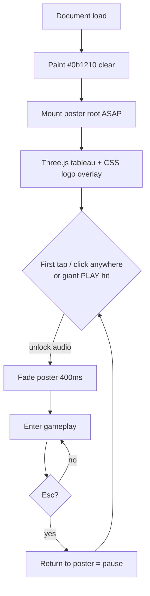
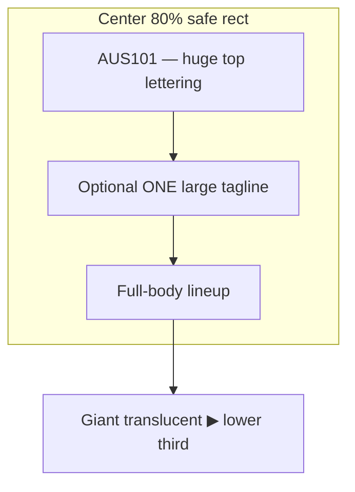

# AUS101 TITLE / FIRST FRAME — Movie Poster Boot

## Intent

The first loaded frame of laserbarf.com is cover art, not a menu. Social crawlers and Open Graph screenshotters capture whatever paints in the first paint. A dark instruction screen with a small Start button fails the thumbnail: it reads as UI chrome, not a game. This section specifies a full-scale movie-poster tableau as the brand frame — huge `AUS101` lettering, lineup silhouettes, Gold Coast Carpenter grade — and a single-gesture unlock into gameplay.

## Key decisions

1. **Poster is the product surface.** Thumbnail at ~200–400px must still sell chrome T-101, beach cast, and title. No control lists, no paragraph copy, no “click start” microcopy.
2. **Prefer Option A: live Three.js posed tableau** with a 2D CSS/canvas logo overlay. Rationale: same character meshes as gameplay (zero art fork), slight life (wind on hair/cloth, red-eye pulse, slow camera push-in), and the logo stays razor-sharp at any DPR because type is not baked into a 3D texture. Option B (baked PNG/WebP) is the fallback only if first-paint budget or mesh-load latency misses the OG screenshot window.
3. **One unlock gesture.** Tap/click anywhere on the poster unlocks audio and enters play; optionally reinforce with one giant translucent PLAY triangle in the lower third (still readable at thumbnail scale). No small button. No instructional overlay.
4. **Never black void.** `html`/`body`/`clear` color `#0b1210` immediately. Poster composition mounts ASAP (placeholders OK). Fade poster → gameplay in 400ms after first click. Esc returns to poster as pause/brand frame.
5. **Silhouette-first cast.** Center and flanks must read at 160px: chrome robot, orange Ken-jock, bikini beach babe, long-sleeve SIGMA_07. Optional goth + seagull are secondary mass, not competing for center.
6. **Safe area for title.** `AUS101` lives inside a center 80% rect so Dynamic Island / letterboxing cannot crop the word.

## Boot → poster → play



## Layout (thumbnail-safe)



ASCII (poster frame, ~200–400px mental model):

```
┌────────────────────────────────────────┐
│              #0b1210 bleed              │
│   ┌────────── 80% SAFE ──────────┐     │
│   │         A U S 1 0 1          │     │
│   │    (huge; far-readable)      │     │
│   │   "TERMINATE UV" (optional)  │     │
│   │                              │     │
│   │   [goth?]  Ken  AUS101  Babe │     │
│   │            ♂     T-101   ♀   │     │
│   │              SIGMA_07        │     │
│   │         (long sleeves ON)    │     │
│   │         seagull / air        │     │
│   │                              │     │
│   │            ◁ ▶ ▷             │     │
│   │     (giant translucent PLAY) │     │
│   └──────────────────────────────┘     │
│   Gold Coast + boardwalk / teal-orange │
└────────────────────────────────────────┘
```

## Visual brief

**Background.** Gold Coast beach + boardwalk under harsh noon sun. Color grade: Carpenter synth — deep teal shadows, hot orange speculars, chrome catching both. Horizon low enough that full-body cast clears the logo band.

**Cast lineup (center-out).**

| Slot | Archetype | Silhouette must-read | Notes |
|------|-----------|----------------------|-------|
| Center | AUS101 | Chrome T-101, red eyes, rigid robot mass | Dead-center; eye pulse ~0.8–1.2s |
| Left flank | Ken-jock | Shirtless orange/tan, shark tooth, dyed hair | Broader shoulders than SIGMA |
| Right flank | Beach babe | Bikini / beach cut, open stance | Contrasts Ken mass |
| Near-center flank | SIGMA_07 incel | Long sleeves ON, narrower vertical | Never bare-arm; distinct from Ken |
| Optional | Goth + seagull | Secondary; shoulder or air | Must not merge with AUS101 chrome at 160px |

**Logo.** Top of safe rect: **AUS101** — one wordmark, maximum scale that still fits the 80% width with margin. CSS/canvas overlay (not 3D text). No subtitle stack. No HUD. No “controls” legend.

**Tagline (optional, max one).** If present, one short line only, still LARGE — e.g. `I'LL BE BACK WITH SPF 50+` or `TERMINATE UV`. If it competes with the wordmark at thumbnail size, drop it.

**PLAY affordance.** Either (1) entire poster is the hit target with no chrome, or (2) one giant translucent triangle in the lower third, opacity ~0.35–0.55, edge soft enough to feel printed, large enough that at 200px wide the triangle is still an obvious play glyph. Do not label it “Start.”

## Implementation (Option A)

**Scene.** Reuse gameplay character meshes in a dedicated `PosterScene` (or boot mode flag). Fixed poses, slight idle: cloth/hair wind, red-eye emissive pulse, camera dolly ~2–4% over 8–12s loop (or one-shot push that resets softly). Lights: hard key (sun), teal fill, orange rim on chrome.

**Overlay.** Absolute fullscreen layer above the canvas:
- `AUS101` wordmark (web font or tight canvas fillText with letter-spacing tuned for distance read).
- Optional tagline.
- Optional PLAY triangle (CSS or canvas); pointer-events can be on the whole overlay.

**Load order.**
1. Set clear / CSS background `#0b1210`.
2. Show poster shell (logo + gradient/placeholder beach) in first paint.
3. Stream meshes; swap placeholders for posed cast without flashing black.
4. On first pointerdown: `AudioContext` resume / unlock, 400ms opacity fade of poster root, handoff to gameplay camera/systems. Keep poster subgraph mounted or quickly remountable for Esc → pause.

**Esc / pause.** Esc restores poster (brand frame) and pauses sim. Second click/PLAY resumes same as cold start unlock path (audio already unlocked).

**Fallback (Option B).** If mesh time-to-poster exceeds OG capture SLA, ship a single fullscreen WebP/PNG of the approved still plus the same CSS logo/PLAY overlay and fade contract. Live tableau remains the target; baked art is contingency, not the brand source of truth.

## Silhouette & safe-area checks

- Export or screenshot poster at 160px, 240px, 400px widths. Pass only if AUS101 letters are legible and four primary archetypes remain distinct without color reliance (robot block vs orange Ken vs bikini vs sleeved vertical).
- Logo bounding box ⊆ center 80% of viewport width and height (title vertical band in upper safe zone). Pad for notch / Dynamic Island.
- No UI chrome in the capture: no FPS, no mute icon, no hamburger, no “tap to start” paragraph.

## PR slice — poster-first boot

**Scope (one PR):**

1. Boot path paints `#0b1210` and mounts poster root before gameplay HUD.
2. `PosterScene` (Three.js) with posed AUS101 + Ken + babe + SIGMA_07; optional goth/seagull behind feature flag.
3. CSS/canvas overlay: giant `AUS101`, optional one tagline, optional giant PLAY triangle; full-poster click = unlock.
4. First gesture → audio unlock + 400ms fade → gameplay.
5. Esc → poster pause frame.
6. Thumbnail fixtures: 160 / 240 / 400px screenshots in PR description; silhouette checklist ticked.
7. No instruction menu as first frame; delete or gate any legacy “click start” dark screen behind a non-default flag.

**Out of scope for this PR:** new character meshes, full audio mix, gameplay balance, Open Graph meta tag hosting (can follow; first-frame paint is the thumbnail source for laserbarf.com’s own screenshot pipeline).

**Acceptance:** Cold load on mobile and desktop shows poster within first meaningful paint; at 300px-wide capture, `AUS101` reads and cast silhouettes differentiate; one tap enters game; Esc returns to poster.

## Non-goals

- Multi-line plot synopsis on the poster.
- Small Start / Options / Credits row as the hero CTA.
- Baking the wordmark into a low-res 3D plane (overlay owns type).
- Dark empty canvas while assets load.

## Summary

AUS101’s public face is a Carpenter-grade Gold Coast movie poster with chrome T-101 dead-center and a readable beach-cast flanking line. Prefer a live Three.js tableau plus crisp 2D type so the thumbnail matches the game and still breathes. Anywhere-click (or one giant PLAY) unlocks audio and fades into play in 400ms; Esc restores the brand frame. Ship poster-first boot so laserbarf.com never advertises a blank menu again.
