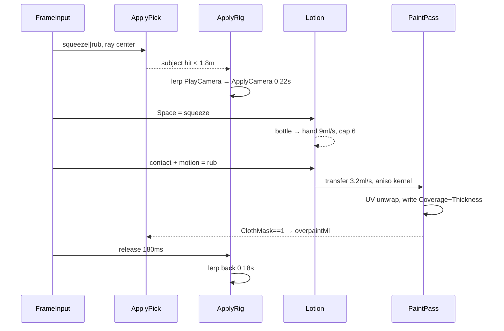
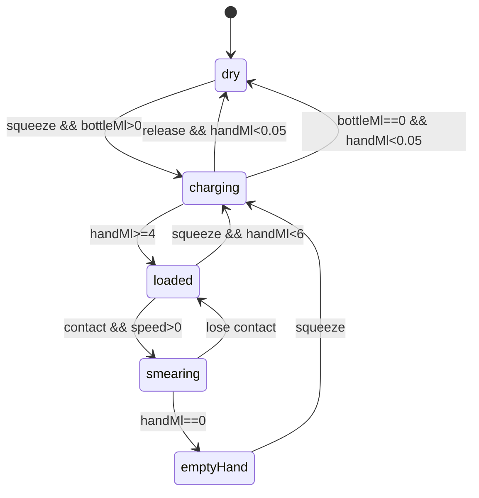
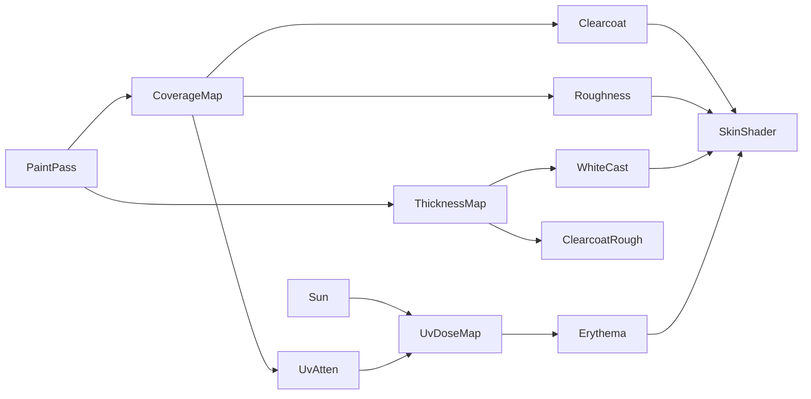
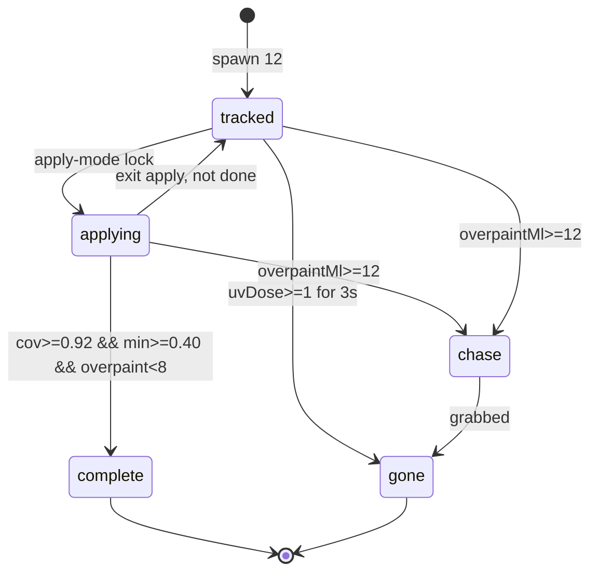

# AUS101 — Systems (Part 1)

Committed playable HTML plus a small `src/` tree. No server. No network after first paint. T-101 (model id `AUS101`) applies SPF on an Australian beach. Score is coverage. Everything else is a fail state.

## 1. Humor encoded in systems

Comedy is the state machine, not overlay copy.

- **Mission.** Cover twelve UV-tracked subjects. Win: mean coverage ≥ 0.92, no patch < 0.40. Score = `1000 * meanCoverage * (1 - 0.5 * overpaintPenalty)`.
- **T-101.** Chrome-and-flesh applicator. Does not tan or burn. It paints. 14 voice one-shots, event-triggered (`bottleEmpty`, `subjectComplete`, `overpaintChase`, `laserLock`). No joke timer.
- **Twelve subjects.** Each slot = mesh + `CoverageMap` + `ClothMask` + mood FSM (`idle → wary → chase | complete`). They sunbake until covered, then leave the bay.
- **Overpaint swimwear.** `ClothMask == 1` increments `overpaintMl`. 8 ml: he notices. 12 ml: `chase`. He path-follows T-101; camera stays in apply-mode until finish or grab.
- **Punch / laser.** Always legal, always fatal. Sets `world.wanted = true`, spawns a T-101 helicopter swarm (12 hulls, instance count = live subjects + 4). Game over after 2.4 s lock-on.

Constants live in `src/sim/rules.js`:

```js
export const RULES = Object.freeze({
  winMeanCoverage: 0.92,
  winMinPatch: 0.40,
  overpaintNoticeMl: 8,
  overpaintChaseMl: 12,
  punchToSwarmS: 0.0,
  swarmLockS: 2.4,
  bottleMl: 200,
  handMinMl: 4,
  handMaxMl: 6,
  subjects: 12,
});
```

## 2. Viewport / iPhone Safari shell

Target: iPhone Safari, landscape-primary, notch and home indicator live. Desktop is the same CSS.

**HTML head (committed playable):**

```html
<meta name="viewport" content="width=device-width, initial-scale=1, maximum-scale=1, user-scalable=no, viewport-fit=cover">
<meta name="apple-mobile-web-app-capable" content="yes">
<meta name="mobile-web-app-capable" content="yes">
<meta name="apple-mobile-web-app-status-bar-style" content="black-translucent">
<meta name="theme-color" content="#0b1210">
```

**CSS contract:**

| Token | Value | Why |
|---|---|---|
| canvas size | `100vh` × `100vw`, **not** `100dvh` | iOS `dvh` jumps on URL-bar show/hide and resizes the GL canvas |
| actual pixels | `window.innerWidth` × `window.innerHeight` | Safari lies about CSS px under notch; `innerHeight` matches the compositor |
| background | `#0b1210` | matches clear color; no white flash on overscroll |
| `user-select` | `none` on `html, body, canvas` | long-press must not select |
| `touch-action` | `none` on canvas | no pan/zoom steal |
| `-webkit-touch-callout` | `none` | no save-image sheet |
| safe-area probes | 4× 1 px `position:fixed` divs at `env(safe-area-inset-*)` | read `getBoundingClientRect` once per resize; HUD insets from those numbers, not from CSS env in JS |
| DPR | `Math.min(devicePixelRatio, 2)` | cap 2; never 3 on Pro Max |
| WebGL canvas | one element, one `WebGLRenderer`, lifetime = page | **never** recreate the context on rotate / URL-bar / tab-back |
| orientation | `screen.orientation.lock('landscape-primary')` when allowed; else CSS rotate prompt overlay |

Resize path (`src/shell/viewport.js`):

```
onResize():
  w = innerWidth; h = innerHeight
  dpr = min(devicePixelRatio, 2)
  renderer.setPixelRatio(dpr)
  renderer.setSize(w, h, false)   // do not touch canvas.style
  camera.aspect = w / h
  camera.updateProjectionMatrix()
  hud.applySafeArea(probeRects())
```

`setSize(..., false)` keeps CSS at `100vh`/`100vw`. Recreating `WebGLRenderer` on iOS drops the context and all 12 coverage maps. Hard rule.

Input chrome: left virtual joystick (deadzone 0.18, radius 56 CSS px, above home-indicator inset + 12 px). Right hold zone = Apply. WASD/arrows move, Space = squeeze, Shift = rub on desktop. Punch = two-finger or `F`. Laser = three-finger or `G`.

## 3. Input + Apply Mode camera

Two cameras, one renderer. `PlayCamera`: third-person follow, offset `(0, 1.6, 3.2)`, lerp 8 Hz. `ApplyCamera`: surface-locked orbit while the trigger is down.

```js
/** @typedef {{ x:number, y:number, squeeze:boolean, rub:boolean, punch:boolean, laser:boolean, lookDx:number, lookDy:number }} FrameInput */

export function sampleInput(prev, pointers, keys) { /* ... */ }

export const ApplyRig = {
  // subject-local spherical coords
  yaw: 0, pitch: 0.35, radius: 1.15,
  pitchMin: 0.08, pitchMax: 1.15,
  radiusMin: 0.55, radiusMax: 2.40,
  enterLerpS: 0.22, exitLerpS: 0.18,
};
```

Enter Apply when `squeeze || rub` and a center ray hits a subject within 1.8 m. Exit when both triggers release 180 ms **or** the subject leaves the 2.4 m leash.

- Stick / WASD orbit (`lookDx`, `lookDy` → yaw/pitch). Deadzone 0.18.
- Space holds squeeze. Release with lotion on the hand starts rub if the pointer is on skin.
- HUD reticule locks to that bay slot (§7). Radius = `max(radiusMin, hit.distance * 0.62)` so the camera stays out of the mesh.

Raycast layer `ApplyPickLayer` (bit 2) includes cloth/hair/props so overpaint is pickable. Sand and sky are not.

## 4. 3D surface mapping

Coverage is a UV-space mesh paint pass, not a screen decal. Turning the body must not smear lotion into the sand.

**Maps per subject** (all `THREE.FramebufferTexture` or raw `WebGLRenderTarget`):

| Map | Size | Format | Role |
|---|---|---|---|
| `CoverageMap` | 256×256 | `R8` (`gl.R8`, fallback `RGB`) | 0–1 fraction of skin with film |
| `ThicknessMap` | 256×256 | `R8` | film thickness, 0–1 ≡ 0–0.08 mm |
| `ClothMask` | 256×256 | `R8` | 0 = skin, 1 = swimwear / hair / eyes |
| `UvDoseMap` | 256×256 | `R8` | accumulated UV, feeds erythema |

Paint pass (`src/sim/paintPass.js`):

1. Bind a UV-unwrap framebuffer: vertex shader outputs `vec4(uv * 2.0 - 1.0, 0, 1)`. Same index buffer as the body.
2. Fragment: if `ClothMask == 1`, write to an overpaint accumulator (CPU-read 8×8 downsample each 250 ms), do **not** raise `CoverageMap`.
3. Else: `coverage = max(coverage, step(0.02, thickness))`; `thickness = clamp(thickness + deposit, 0, 1)`.
4. Deposit is a 2D anisotropic kernel in UV, warped by a precomputed `UvMetric` texture (texel area in m², 128×128 `RG16F`) so a chest texel and an ear texel get the same ml/m².

Brush stamp: 24 px radius at 256, falloff `pow(1 - r, 1.6)`. One stamp per 2.5 mm of surface travel (arc length from last hit, not UV distance).

Readback for score: once per 200 ms, `gl.readPixels` a 64×64 blit of `CoverageMap` (not the 256). Mean of skin texels (where `ClothMask == 0`) is `subject.coverage`. Patch min is the 5th percentile of that blit.

## 5. Squeeze-then-rub finite lotion physics

Lotion is conserved. Bottle 200 ml. Hand 4–6 ml. No infinite spray.

```js
export const Lotion = {
  bottleMl: 200,
  handMl: 0,
  handCapMl: 6,
  squeezeRateMlS: 9.0,     // bottle → hand while Space held and nozzle open
  transferRateMlS: 3.2,    // hand → skin while rubbing contact
  dripRateMlS: 0.55,       // hand excess above 6 ml, or vertical film > 0.85
  smearAniso: 2.8,         // kernel aspect along motion tangent
  minTransferMl: 0.02,
};
```

States (mermaid below):

- **`dry`** — `handMl < 0.05`. Rub is a no-op. Squeeze opens the bottle.
- **`charging`** — Space + nozzle in frame, +9 ml/s, cap 6. Past 6 drips to sand (`-score` 2 pts/ml).
- **`loaded`** — `handMl ∈ [4, 6]`. Palm sheen. Ready to rub.
- **`smearing`** — contact + motion. 3.2 ml/s into `ThicknessMap`, aniso kernel along surface velocity. Speed < 0.08 m/s deposits a blob (streaks).
- **`empty-hand`** — `handMl == 0` mid-rub. Audio tick. Return to bottle.

Drip: thickness > 0.85 on tris with `normal · up < 0.25` lose 0.55 ml/s → 1 px sand decals. Waste, not new coverage.

Squeeze charges only if the ray hits the bottle **or** T-101 is in bottle-hold pose (left hand occupied). Blocks Space-mash.

## 6. Skin lighting

One `MeshPhysicalMaterial` subclass (`src/mat/skin.js`). Maps drive it. No second lighting model.

| Signal | Map | Shader use |
|---|---|---|
| dry skin | none | `roughness 0.72`, `clearcoat 0.0`, `sheen 0.15` (peach) |
| film present | `CoverageMap` | `clearcoat = 0.55 * coverage`, `roughness = mix(0.72, 0.28, coverage)` |
| thick film | `ThicknessMap` | `clearcoatRoughness = mix(0.35, 0.08, thickness)`; white-cast `+ vec3(0.10) * thickness` |
| UV dose | `UvDoseMap` | `UvDose += dt * sunIrradiance * (1 - 0.92 * coverage)` |
| erythema | derived | `albedo *= mix(1.0, vec3(1.0, 0.45, 0.42), smoothstep(0.55, 1.0, uvDose))` |

White-cast is the gag and the readout: painted chest = zinc stripe, not wet look. Unpainted skin goes red. Miss is a color, not a number.

Sun: one `DirectionalLight` (2.4 lx, `0xffe2b0`) + hemisphere (`0x87b8ff` / `0xc2a070`). No shadows on paint targets. 512-px sand shadow map covers T-101 and the swarm only.

## 7. Twelve-slot reticule bay

HUD is a 12-cell bay along the safe-area top (left if `innerWidth < 700`). One cell per subject.

```js
/** @typedef {{
 *   id: 0|1|2|3|4|5|6|7|8|9|10|11,
 *   state: 'empty'|'tracked'|'applying'|'complete'|'chase'|'gone',
 *   coverage: number,          // 0..1
 *   overpaintMl: number,
 *   uvDose: number,
 *   mesh: THREE.Object3D,
 *   maps: { coverage, thickness, cloth, uvDose }
 * }} ReticuleSlot
 */
```

Lifecycle:

1. Boot: 12 subjects spawn in a 28 m beach strip. Each slot = `tracked`.
2. Apply-mode ray hit promotes that slot to `applying` (gold ring, 2 px).
3. `coverage ≥ 0.92` and `minPatch ≥ 0.40` and `overpaintMl < 8` → `complete`. Subject walks off. Slot stays as a green pip.
4. `overpaintMl ≥ 12` → `chase`. Slot goes red. Other slots keep ticking UV.
5. Grab or swarm → all slots `gone`.
6. All 12 `complete` → win.

Tapping a pip yaws the camera at that subject (0.3 s), no teleport. UV-track mark is a projected 18 px circle at the last paint hit.

## 8. Fail states

| Id | Trigger | Result | Recoverable |
|---|---|---|---|
| `sunburn` | any slot `uvDose ≥ 1` for 3 s | that subject leaves angry; slot `gone`; if 3 gone this way, lose | no |
| `overpaint-chase` | `overpaintMl ≥ 12` | guy chases; grab on contact (`dist < 0.55 m` for 0.4 s) | yes, if you finish other 11 and never get grabbed |
| `grabbed` | chase contact | game over, 1.2 s hold, then restart prompt | no |
| `punch` | `input.punch` | `wanted = true`, swarm in 0 s | no |
| `laser` | `input.laser` | same as punch, red beam first | no |
| `swarm-lock` | `wanted` for 2.4 s | 12 helicopters, game over card | no |
| `bottle-dry` | `bottleMl == 0` and mean coverage < 0.92 | lose (text: “200 ml. That’s the joke.”) | no |
| `drown-drip` | 40 ml dripped to sand | warning only; not a lose | — |

Restart = sim reset, not a WebGL recreate. `glClear` the maps. Same canvas.

## 9. Performance budget

iPhone 13-class, 60 Hz when the URL bar is hidden, 30 Hz floor.

| Resource | Budget | Note |
|---|---|---|
| triangles, world | 90 k | beach 20 k, T-101 18 k, 12 bodies × 4 k, FX 4 k |
| triangles, apply-mode | +0 | same meshes; paint is UV pass |
| textures | 48 MB | 12 × 4 × 256 R8 = 3 MB maps; 2 k sand; 1 k sky; skin atlases 2 k |
| draw calls | 45 | bodies instanced in idle, unique when `applying` or `chase` |
| paint pass | 1.2 ms | one subject / frame, the `applying` one |
| readback | 0.4 ms / 200 ms | 64×64 R8 |
| JS sim | 2.0 ms | lotion + FSM + chase |
| DPR | ≤ 2 | see §2 |
| audio voices | 8 | one-shots, no music stream |

If `dt > 28 ms` for 20 frames: drop sand shadows, paint at 128, freeze idle bodies beyond 12 m. Never drop the canvas.

## 10. Mermaid

### Apply-mode sequence



### Lotion state machine



### Coverage → lighting



### Reticule lifecycle



## 11. Key decisions for this part

1. **Coverage is UV-space, 256 R8, not screen decals.** Turning cannot fake a win. Cost: one extra pass on the locked body.
2. **`100vh` + `innerHeight`, never `100dvh`, never recreate WebGL.** iOS URL-bar and rotate are resize events, not context events.
3. **Finite 200 ml / 4–6 ml hand.** The bottle is the clock. Infinite spray deletes the joke and the drip system.
4. **Punch and laser are first-class and instant lose.** Hide them and the swarm is a cutscene. Easy to hit by accident (two- / three-finger).
5. **ClothMask is a paint reject, not a collision reject.** You can paint the trunks. That is the chase trigger.
6. **DPR cap 2, paint one subject per frame, 64×64 readback.** The beach is cheap; the maps are the budget.
7. **Restart clears maps, keeps the context.** iOS will not give the context back reliably.
8. **White-cast + erythema carry the tutorial.** No popup. Red and zinc.

## 12. Suggested PR slices for this part

| PR | Scope | Done when |
|---|---|---|
| **P1. Shell** | `index.html` viewport meta, `#0b1210`, `100vh` canvas, safe-area probes, `touch-action: none`, DPR cap, `viewport.js` resize that never calls `new WebGLRenderer` | iPhone Safari rotate + URL-bar hide keeps the same GL context; visual viewport matches `innerHeight` |
| **P2. Input + cameras** | `FrameInput`, virtual joystick, WASD/arrows/Space, PlayCamera / ApplyRig lerp, pick layer | hold Space on a body, camera orbits; release 180 ms returns |
| **P3. Maps + paint pass** | UV unwrap target, `CoverageMap` / `ThicknessMap` / `ClothMask` 256 R8, anisotropic stamp, 64×64 readback | painting the chest, then orbiting, keeps the film in UV; trunks do not raise coverage |
| **P4. Lotion FSM** | 200 ml bottle, 4–6 ml hand, squeeze/transfer/drip rates, waste score | empty bottle before 12 bodies is a lose; drip spawns sand decals |
| **P5. Skin shader** | roughness → clearcoat, white-cast, UV dose, erythema | unpainted skin reddens in sun; thick film reads zinc |
| **P6. Reticule bay + fails** | 12 slots, complete / chase / sunburn / punch-laser swarm | overpaint 12 ml chases; `F`/`G` or 2-/3-finger tap spawns 12 helicopters in 2.4 s |

Do not land P6 before P3: chase and score are liars without a real `CoverageMap`.
