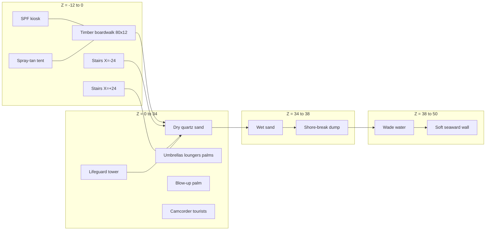
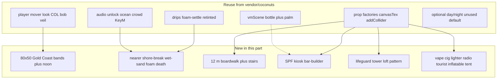

# Part 2 — World

AUS101 is a greenfield walkaround at `/Users/wm/Desktop/repo/sunscreen`. The playable artefact is a committed `dist/index.html`: vendored Three.js, no server, no CDN, no runtime fetch. This part specifies only the world.

Coconuts ([a-better-internet/coconuts](https://github.com/a-better-internet/coconuts)) is a single ~160 KB Three r128 file of Coconuts Beach Bar, Ocean City MD. Extract code, not place. Hotel, castle, bar interior, Maryland flags, drinks, intoxication, foam gun, and the r128 CDN stay behind. Keep the mover, procedural sound, first-person overlay, foam-settle math (lotion only), and prop factories.

The new majority is an ~80 × 50 m Gold Coast beach, a 12 m timber boardwalk, a nearer shore-break whose foam dies on wet sand, an SPF kiosk, a lifeguard tower, and film-culture set dressing. Those props do not fire, cut, or apply to other players.

## Coordinate frame

Origin: dry sand at the boardwalk face, mid-strand.

| Axis | Direction | Span |
| --- | --- | --- |
| +X | north along the strand | −40 … +40 m |
| +Z | seaward | 0 boardwalk face; +38 mean water; +50 wade clip |
| +Y | up | 0 dry sand; boardwalk +1.1; tower deck +4.8 |

Total rectangle 80 × 50 m. Sand is 80 × 38 m to mean water, then 12 m of shallows. Inland, an 80 × 12 m deck on piles (Z = −12 … 0). `COL[]` AABBs close four edges: invisible 2.2 m walls on three sides; a soft waist-high plane at Z ≈ 46.

Three bands, no heightmap:

1. Boardwalk — flat `Y = 1.1`, 80 × 12, plank canvas.
2. Dry / damp sand — `Y = 0` for Z = 0 … 28, then a 6 m ramp down 0.25 m.
3. Wet sand + shallows — `Y = −0.25` for Z = 34 … 38; water surface `Y = 0.15`; wade floor to `Y = −0.9` at Z = 50.

No dunes, rocks, or hotels. Sky is a hard dome plus a distant island billboard (Stradbroke-ish, not OC skyline).

**Noon default.** Keep Coconuts’ day/night toggle (`KeyN`) but boot harsh AU noon: directional `0xfff1c2` intensity 1.85 at `(18, 42, −8)`; hemisphere sky `0x7ec8ff` / ground `0xc4a574` at 0.55; `FogExp2(0xc9dbe8, 0.012)`; PCFSoft 2048, sun only. Night reuses existing moon + lamp/torch. Do not author a new lighting model.

## Reuse from Coconuts

Vendor the original file at `vendor/coconuts/`. Split reusable functions into `src/`. Copy the math; drop OC meshes and strings.

**`src/player.js`** — WASD / arrows; Shift 3.4 → 6.4; pointer-lock look, drag fallback, touch-drag + stick; `COL[]` AABB (player 0.5 × 1.7 × 0.5 box); 60 Hz tick; head bob; veil pause (freezes tick, gain, lock). Spawn `(0, 1.7, 4)` facing +Z. Floor Y comes from AABBs — boardwalk is a floor collider, not a mover fork.

**`src/audio.js`** — unlock on first pointer/key/touch. Ocean: filtered noise + LFO, retuned brighter/closer (dump at Z ≈ 36, not an OC horizon). Crowd node stays, gain down. `KeyM` mute + on-screen `M`. No ice-machine, clink, or foam-gun hiss.

**`src/vm.js`** — keep `vmScene`, swap meshes. Right hand: SPF bottle (cylinder + pump + label canvas), idle bob. World-space palm sprig, not a weapon. World exposes `vm.drip()`; apply-lotion animation belongs to the interaction part.

**`src/drips.js`** — foam-settle only. Disc + streaks, opaque white-yellow, ~1.8 s. No spray cone, hose, or knockback. Same particle pool, retinted.

**Prop factories** — `umbrella`, `chair`, `lounger`, `palm`, `gull`, `surfboard`, `beachBall`, `lamp`, `torch`, `cup`, plus `canvasTex`, `mat`, `box`, `addCollider`. Recolour for Gold Coast (aqua/coral supermarket stripes, not Maryland red-gold). Palms and gulls stay. Cups are empty slushies, not schooners. Lamps/torches exist for night and sit unlit at noon. Every solid goes through `addCollider`.

**Do not reuse as setting:** hotel / castle / bar; Maryland or any national flags; drinks / intox; foam-gun mesh; Three r128 from unpkg/jsdelivr. Vendor Three (r160 or current r1xx) at `vendor/three/`.

## New terrain

**Sand / water.** Dry: `PlaneGeometry(80, 38)`, quartz canvas `0xe6c98a`, sparse shell dots. Wet: `80 × 8` at `Y = −0.25`, `0xc4a06a`, roughness 0.45 — foam death zone. Water: `80 × 16` at `Y = 0.15`, teal, two-sine vertex displace (4.2 s / 7.0 s) on the 60 Hz tick. Move Coconuts’ water mesh inshore; no shader rewrite.

**Shore-break.** Dump line Z ≈ 36 (2 m seaward of wet sand). Three ribbons 70 × 0.8 × 0.6 m, 11 s cycle, −Z at ~2.4 m/s. At Z = 36: scale Y to 0.08 in 400 ms, spawn settle discs along the crest. Disc on wet sand fades in 300 ms; disc in water lingers 1.2 s. No foam on dry sand. Collapse ducks the ocean high-shelf +200 Hz for 0.5 s.

**Boardwalk.** 80 × 12 at `Y = 1.1`. Ironbark plank canvas `0x6b4a2b`. Piles every 4 m, two rows (Z = −11, −1). Seaward rail 1.0 m, posts every 2 m; landward edge open. Stairs: two 3 m flights at X = ±24, six risers, each `box` + `addCollider`. One deck AABB snaps the mover to `Y = 1.1`. Most film props live here.

## Kiosk and tower (bar-builder only)

Coconuts builds the bar from stacked `box()`, canvas signs, and `addCollider`. Harvest that pattern. Do not import the bar mesh.

**SPF kiosk** at (−14, −6) on the deck, 4.2 × 3.0 × 3.2 m. Three plywood walls, service face to +Z, hatch to +X. Awning canvas “SPF / ZINC / 50+” — no real brand. Counter AABB; buy flow is a later part. Corrugated-canvas roof. One `lamp` under the awning.

**Lifeguard tower** at (18, 6) on dry sand. 3 × 3 footprint, deck `Y = 4.8`, roof `Y = 6.4`. Splayed timber legs (~8°), X-brace. Landward stair, 16 AABB risers (same loft trick as the OC bar). Rail 0.9 m, seaward watch gap. Yellow-red SLSA-ish panels, no official mark. `chair` + `torch` on deck; binoculars are a static mesh. Climbable — the vertical beat the hotel used to provide.

## Film-culture props (scenery, not weapons)

New factories in `src/props/film.js`. Under 40 tris except the tent. Not inventory.

| Prop | Factory | Place | Behaviour |
| --- | --- | --- | --- |
| Vape | `vape({led})` | 6 on rails / kiosk | LED 1.6 s; puff every 4–7 s (drip sprite, grey, +0.6 m) |
| Cigarette | `cig()` | 8 in trays / dummy lips | Ember 0.15; thin smoke |
| Novelty lighter | `lighter({skin})` | 3 on counter / lounger | Banana / skull / thong canvas. No jet |
| Portable radio | `radio()` | 2 sand, 2 deck | Spatial 3-tone bed; `KeyM` mutes |
| Camcorder tourist | `touristCam()` | 3 on sand, face sea | Box cam + red REC. No pathing |
| Blow-up palm | `inflatablePalm()` | (−32, 10) | Gloss, sine sway; 0.4 m trunk collider |
| Spray-tan tent | `tanTent()` | (28, −7) on deck, 2.4³ | Orange nylon, `0xff8844` interior, flap haze, solid AABB |

Dummies are capsule + sphere if Coconuts has them, else three boxes. No dialogue.

Cluster: deck holds kiosk, tent, radios, most vapes and lighters. Sand holds loungers, umbrellas, real palms, tower, tourists, inflatable, plus `beachBall` / `surfboard` / `gull`. Keep the centre (X ∈ [−8, 8], Z ∈ [8, 22]) open so the first ten seconds of walk-to-sea read as a beach.

## World layout



## Reuse vs new



## Key decisions

1. **Extract, do not reskin.** Keep functions; delete the OC level.
2. **Vendor Three and Coconuts.** `dist/index.html` runs from `file://` with zero network. No r128 CDN.
3. **Noon is the product.** Day/night is a leftover switch.
4. **Foam dies on wet sand.** That rule is the nearer Australian shore-break.
5. **Bar-builder, not bar.** Kiosk and tower are `box` + `canvasTex` + `addCollider`, new drawings.
6. **Film props are set dressing.** LED, puff, beep, REC. No damage, no foam-gun successor.
7. **One floor-Y model.** Sand 0, boardwalk 1.1, tower 4.8, all AABBs. Do not fork the mover.
8. **80 × 50 m is the budget.** Miss 60 Hz on a 2019 laptop: cut gulls and tourists first, not the wave cycle.

## Build and commit shape

```
sunscreen/
  vendor/coconuts/     # unmodified snapshot + NOTICE
  vendor/three/        # three.module.js, not r128 CDN
  src/
    main.js            # scene, noon light, tick, veil
    player.js          # extracted mover
    audio.js           # extracted graph, retuned ocean
    vm.js              # SPF bottle + palm
    drips.js           # settle pool
    world.js           # bands, waves, boardwalk, kiosk, tower, scatter
    props/core.js      # canvasTex, mat, box, addCollider
    props/beach.js     # umbrella, chair, lounger, palm, gull, …
    props/film.js      # vape, cig, lighter, radio, touristCam, inflatablePalm, tanTent
  dist/index.html      # playable
  dist/game.js
```

Every world PR leaves `dist/index.html` playable: click, lock, walk to water, hear a dump, see foam die on wet sand, climb the tower, stand under the kiosk. First playable may be a concat or relative ES modules (no bare specifiers). `python3 -m http.server` is convenience, not a contract.

## PR slices (this part only)

| PR | Scope | Done when |
| --- | --- | --- |
| **W0** | Vendor Coconuts + Three; `dist/index.html` noon sand plane | `file://` lit ground, no CDN |
| **W1** | Extract player + `COL[]`, edge walls, bob, veil, lock | WASD + Shift 3.4/6.4; stay in 80 × 50 |
| **W2** | Bands: boardwalk, stairs, dry/wet, wade; floor AABBs | Deck → stairs → sand → wet, no fall-through |
| **W3** | Shore-break + foam death on wet sand; retune ocean | Three waves, dump Z=36, no dry-sand foam |
| **W4** | Beach factories + scatter; harsh noon | Reads as a beach from spawn |
| **W5** | Kiosk + tower from bar-builder | Tower deck Y=4.8; kiosk blocks |
| **W6** | `film.js` + placements; radios on mute graph | Seven prop types; KeyM silences radios + ocean |
| **W7** | `vm.js` bottle + palm; optional `KeyN` night | Viewmodel bobs; noon remains default |

W3 is the first recognisably AUS101 PR. W6 is the first recognisably this joke. Later parts hook `vm.drip()` and the kiosk counter. They do not reopen the 80 × 50 m envelope.
